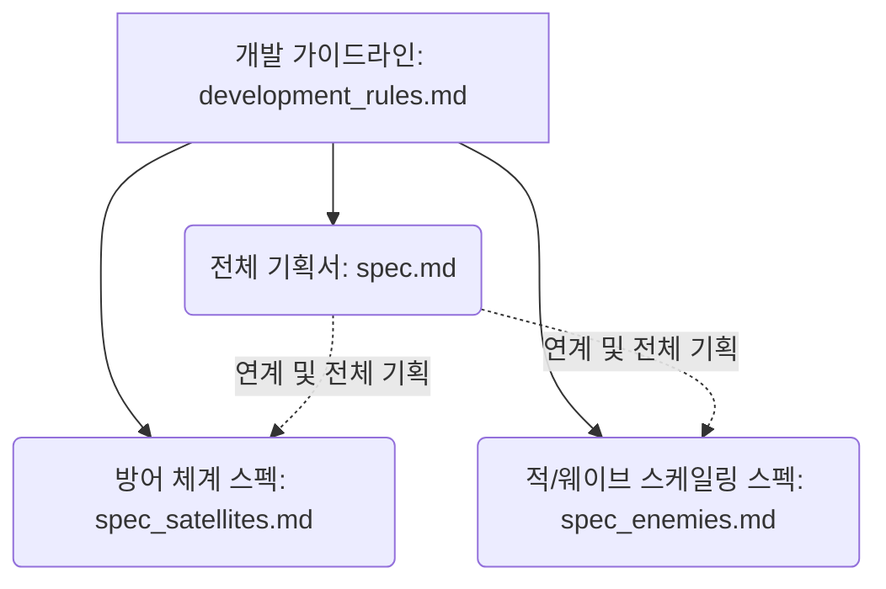

# 디펜스 어스 (Defense Earth): 개발 가이드라인 및 개발 규칙

이 문서는 디펜스 어스(Defense Earth: Cosmic Loop) 프로젝트의 코드 구현, 테스트 작성 및 기능 고도화 시 준수해야 하는 **개발 가이드라인 및 기획 사양 참조 규칙**을 규정합니다.

---

## 1. 핵심 기획 사양 참조 규칙 (Core Specification Guidelines)

프로젝트 개발 및 리팩토링 시, 아래 **3대 스펙 문서**를 엄격히 동기화하고 참고하여 개발을 진행해야 합니다. 임의로 코드 내에 하드코딩하거나 스펙에 없는 변수/수식을 도입하는 것은 금지됩니다.

### 1.1. 전체 기획서: [spec.md](file:///Users/cowuncle/dev/defense_earth/spec.md)
* **목적**: 게임의 핵심 루프, 자원 구조, 행성별 고유 환경 및 테라포밍 해금 시스템, 태양계 시너지 구성, 타임머신 루프 정산 공식 등 **상위 게임 디자인 및 시스템 구조**를 정의합니다.
* **주요 참고 영역**: 신규 행성 개발 로직, 영구 업그레이드(TP) 계열 및 정산 로직, 자동화 QoL 기능 및 모의 BM 설계.

### 1.2. 아군 방어 체계 및 함대 상세 스펙: [spec_satellites.md](file:///Users/cowuncle/dev/defense_earth/spec_satellites.md)
* **목적**: 궤도 방어 위성, 궤도 방어 기지, 쉽야드 생산 함대, 행성 실드 모듈의 **수치와 상세 업그레이드 가격 및 수치 강화 공식**을 정의합니다.
* **주요 참고 영역**: 위성 레벨업에 따른 데미지/공격속도/사거리 스케일링, 추가 위성 건설에 따른 비용 가중 공식($1.5^C$), 쉽야드 함대 수리 및 데미지 감소율 산출, 실드 최대 용량 계산 공식.

### 1.3. 외계 침공군 및 웨이브 난이도 스케일링 스펙: [spec_enemies.md](file:///Users/cowuncle/dev/defense_earth/spec_enemies.md)
* **목적**: 외계 적 함선의 기본 능력치, **웨이브 난이도 증가에 따른 HP/데미지/보상/속도 스케일링 배율 수식**, 그리고 웨이브별 총 적 스폰 수량 및 스폰 속도 산출식을 정의합니다.
* **주요 참고 영역**: `alien_specs` 데이터 스토어 정의, 웨이브 진행에 따른 적 동적 스폰 및 웨이브 레벨링 로직 구현, 테스트 코드에서의 적 스폰 검증 Assert.

---

## 2. 코드 및 품질 관리 규칙 (Code Quality Rules)

1. **Zustand 스토어의 일관성 유지**:
   * 게임 상태 및 수치 연산은 `src/store/gameStore.js`에서만 관리합니다.
   * 위성과 쉴드의 강화 수치, 적 HP/데미지 배율 공식은 [spec_satellites.md](file:///Users/cowuncle/dev/defense_earth/spec_satellites.md) 및 [spec_enemies.md](file:///Users/cowuncle/dev/defense_earth/spec_enemies.md)에 기술된 수학적 공식을 그대로 코드로 투영해야 합니다.
2. **자동 플레이테스트 및 기능 검증 하네스 준수**:
   * 새로운 기능(예: 위성 종류 추가, 새로운 적 기믹 추가) 개발 시, `__tests__/` 아래의 Jest 시뮬레이션 테스트를 반드시 함께 업데이트해야 합니다.
   * `npm run test` 및 `node run-harness.js`가 에러 없이 성공하는 상태를 상시 유지해야 합니다.
3. **환경 페널티 및 과학 연구 기믹 구현**:
   * 행성별 고유 환경 페널티(예: 금성의 부식, 수성의 방사능으로 인한 비용 상승)와 연구 트리를 통한 페널티 무력화 코드는 기획 문서에 지정된 패널티 배율 및 시너지 수치와 정확하게 일치해야 합니다.
