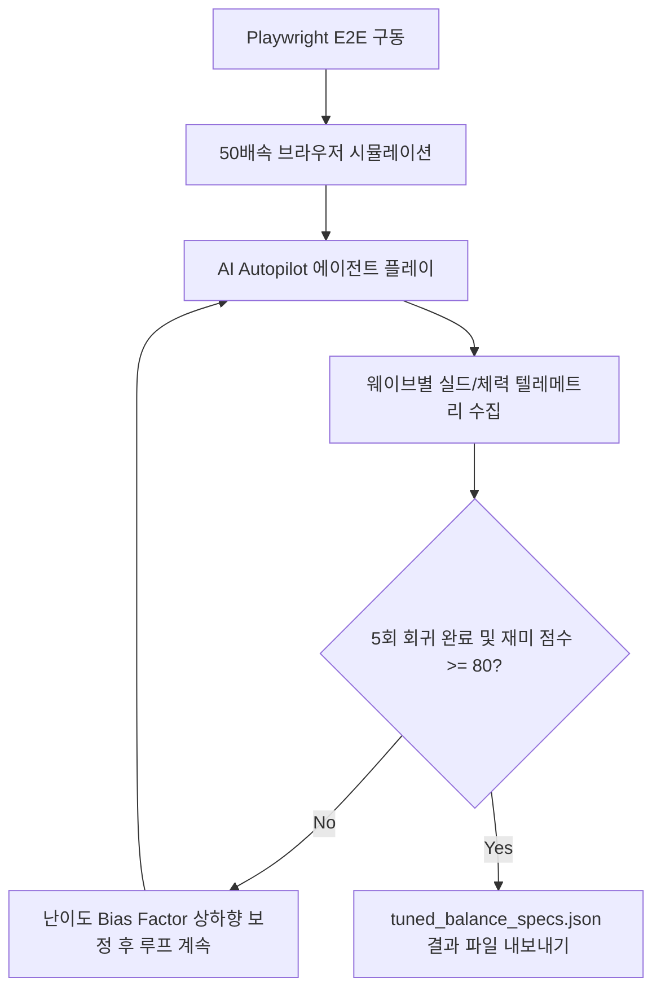

# 🤖 AI 기반 자동 밸런싱(Auto-Balancing) 시스템 가이드

이 문서는 **디펜스 어스(Defense Earth)** 게임 내에서 플레이어를 모방하여 자동으로 게임을 진행하는 **AI 에이전트(Autopilot Agent)**와 게임 플레이 재미 요소를 분석해 적선의 HP/공격력을 스스로 보정하는 **자가 피드백 밸런싱 엔진(Auto-Balancer)**의 작동 원리 및 사용 방법을 안내합니다.

---

## 1. 개요 (Overview)

인간 기획자가 수십 번 플레이하며 수치를 일일이 수정하는 대신, **Playwright E2E 프레임워크**와 **50배속 시뮬레이션 가동**을 활용해 자동으로 5회 이상의 시간 루프(Rebirth/회귀)를 반복 수행합니다. 이 과정에서 획득하는 실시간 긴장도(Tension)와 성장 흐름(Progression) 지표를 수학적으로 점수화하고, 최종적으로 가장 최적화된 난이도 테이블을 `tuned_balance_specs.json` 파일로 도출합니다.



---

## 2. 핵심 구성 요소 (Core Components)

### 2.1. AI 오토파일럿 에이전트 (`autoPlayAgent.js`)
* **목적**: 유저 대신 최적의 빌드 오더 및 의사결정을 실시간 수행합니다.
* **주요 역할**:
  * **인프라 건설**: 크레딧 한도 내에서 주거 지구(Population), 공장(Factory), 발전소(Energy)를 밸런스 있게 업그레이드합니다.
  * **위성 기하급수적 배치**: 가용 전력을 확인하며 레이저, EMP, 플라즈마, 중력포, 클러스터 미사일, 반물질 포 등을 순차적으로 지구 궤도에 배치합니다.
  * **함대 자동 구성**: 쉽야드(Shipyard) 대기열이 비어있을 때 요격기(Interceptor), 호위함(Escort) 등의 전투용 함선을 생산 및 대기열을 유지합니다.
  * **계획된 회귀(Rebirth) 실행**: 타임머신이 100% 충전되고 이전 회귀 대비 최소 성장 목표 웨이브(예: `12 + rebirthCount * 5`)를 만족했을 때만 회귀를 가동해 점진적인 성장을 유도합니다.

### 2.2. 피드백 튜닝 엔진 (`autoBalancer.js`)
* **목적**: 매 웨이브의 긴박감과 클리어 속도를 집계해 재미 점수(Fun Score)를 채점하고 난이도를 동적으로 교정합니다.
* **재미 점수 (Fun Score) 채점식 (100점 만점)**:
  1. **긴장감 점수 (Tension - 40점)**: 실드 최소 잔량이 15% ~ 60% 사이로 바짝 깎인 아슬아슬한 웨이브가 전체의 15% ~ 45% 범위 내에 포함되는지를 판별합니다.
  2. **성장 연속성 점수 (Progression - 45점)**: 매 시간 루프를 돌 때마다 클리어한 최대 웨이브가 이전 루프보다 +3에서 +12 웨이브 범위로 부드럽게 점진적으로 증가해야 감점 없이 만점을 부여받습니다.
  3. **초반 패배 리듬 점수 (Rhythm - 15점)**: 첫 번째 루프(Rebirth 0)에서는 너무 쉽게 쭉쭉 나아가는 것을 방지하고, 15 웨이브 이전에 자연스러운 패배/벽을 경험해 회귀(Rebirth) 시스템의 효용성을 체감하도록 강제합니다.

* **난이도 보정 루프**:
  * 시뮬레이션 완료 시 채점된 Fun Score가 **80점 미만**인 경우, 적 체력 및 데미지 강도 인자를 일괄 조정(예: 너무 쉬운 경우 난이도 1.05x 상향, 너무 어려워 성장 플레이토가 온 경우 0.95x 하향)하여 재미 지표가 80 이상으로 수렴할 때까지 지속해서 플레이를 유도합니다.

### 2.3. 초고속 시뮬레이터 가동 드라이버 (`aiPlaytest.spec.js`)
* **목적**: 헤드리스 브라우저 테스트 환경에서 프레임 타임을 단축하여 빠른 밸런싱 피드백 루프를 보장합니다.
* **속도 제어**: 일반 틱 연산을 분할하는 서브틱 서브 루프(`subDelta`) 기법을 적용하여, **50배속(`50x`) 초고속 연산** 하에서도 물리 충돌 및 공격 시뮬레이션의 물리적 오차나 관통 현상 없이 안정적으로 5회 이상의 Rebirth를 2~3분 내에 마칠 수 있도록 가속합니다.

---

## 3. 실행 및 밸런스 조정 방법

AI 플레이테스트 시뮬레이션 엔진을 직접 실행하고 결과를 도출하는 방법은 다음과 같습니다.

### 3.1. 터미널 명령어를 통한 실행
프로젝트 루트 폴더에서 아래 명령어들 중 하나를 입력합니다.

* **전체 E2E 시나리오 실행 (AI 밸런싱 포함)**:
  ```bash
  npm run e2e
  ```
  이 스크립트는 Expo 웹 서버를 백그라운드에 구동한 뒤 Playwright로 AI 플레이테스트 시나리오 및 일반 UI/보안 기능 E2E 테스트를 일괄 실행합니다.

* **AI 플레이테스트 시뮬레이션만 단독 실행**:
  ```bash
  npx playwright test e2e/aiPlaytest.spec.js
  ```
  콘솔 로그를 통해 초 단위 웨이브 경과, Rebirth 누적 횟수, 그리고 실시간 재미 점수(Fun Score) 변화율을 직접 모니터링할 수 있습니다.

### 3.2. 인게임 개발자 패널 이용 (시각적 확인)
1. 로컬 개발 서버를 실행시킵니다 (`npm run dev` 또는 `npx expo start`).
2. 메인 화면 또는 행성 관리 화면 우측 상단의 **[개발 편의 기능 패널 / Cheats]** 버튼을 클릭합니다.
3. **[AI 자동 시뮬레이션 플레이테스트]** 메뉴에 진입합니다.
4. 배속을 `10x`, `20x`, `50x`로 설정하고 **[AI 플레이테스트 시작]** 버튼을 누르면 화면상의 함대와 위성이 스스로 판단해 건물을 올리고 전투를 치르며 시간이 흐르는 것을 감상할 수 있습니다.
5. 중간 과정 및 채점 이력은 개발자 실시간 로그 모달 영역에 기록됩니다.

---

## 4. 최종 결과물 활용

시뮬레이션이 안전하게 종료되면 루트 경로에 `tuned_balance_specs.json` 파일이 자동 내보내기(Export) 됩니다.

### 4.1. `tuned_balance_specs.json` 예시
```json
{
  "timestamp": "2026-06-21T08:30:13.123Z",
  "funScore": 87,
  "rebirthCount": 5,
  "rebirthHistory": [
    { "rebirthIndex": 0, "maxWaveReached": 11, "tensionRatio": 0.0 },
    { "rebirthIndex": 1, "maxWaveReached": 16, "tensionRatio": 0.18 },
    { "rebirthIndex": 2, "maxWaveReached": 21, "tensionRatio": 0.20 }
  ],
  "specs": {
    "alienSpecs": {
      "scout": { "name": "외계 정찰기", "maxHp": 3, "damage": 4, "speed": 60 },
      "raider": { "name": "외계 약탈함", "maxHp": 3, "damage": 9, "speed": 40 }
    },
    "satelliteSpecs": {
      "laser": { "name": "타겟팅 레이저 위성", "cost": 200, "dmg": 40, "cd": 0.4, "range": 250 }
    }
  }
}
```

* **적용**: 밸런싱 도구에 의해 완전히 검증된 이 수치 필드를 실제 제품 데이터셋(`src/store/gameSpecs.js`)의 `ALIEN_SPECS` 및 `SATELLITE_SPECS` 객체에 대입하면, 최종 릴리즈 상태의 황금 밸런스를 즉각 인게임에 탑재할 수 있습니다.
