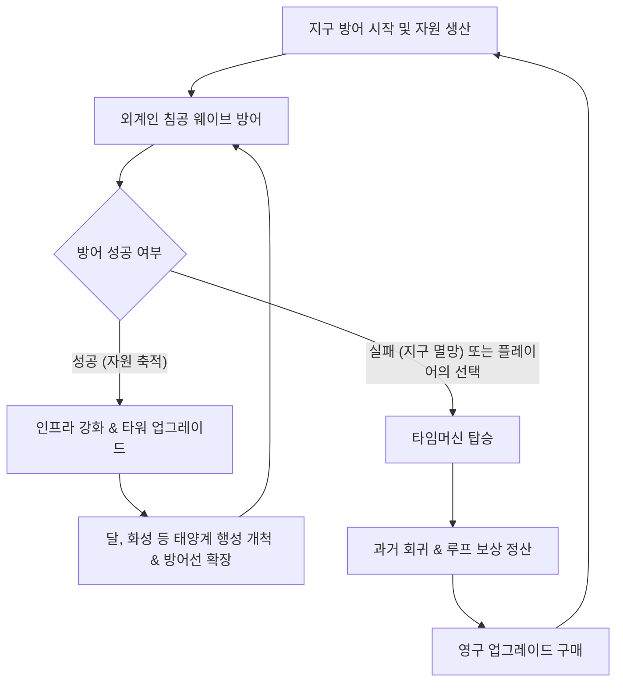
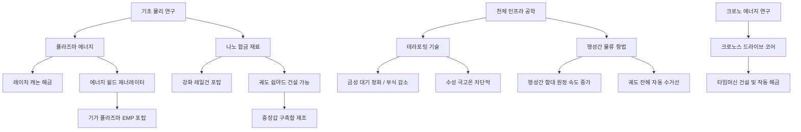
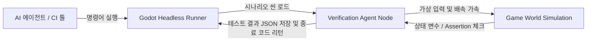

# 게임 기획서: 디펜스 어스 (Defense Earth: Cosmic Loop)

지구와 태양계를 위협하는 외계 침공에 맞서 싸우며, 인프라를 구축하고 타임 루프(환생)를 통해 한계를 극복해 나가는 SF 방어/경영 시뮬레이션 게임입니다.

---

## 1. 게임 개요 (Game Overview)

* **게임 제목:** 디펜스 어스: 코스믹 루프 (Defense Earth: Cosmic Loop)
* **장르:** 방어(디펜스) + 자원 관리(시뮬레이션) + 로그라이트(환생/루프)
* **플랫폼:** PC 및 모바일 (크로스 플랫폼 타겟)
* **핵심 컨셉:** 
  * 외계인의 침공으로부터 지구와 태양계 행성들을 방어.
  * 멸망의 위기에서 타임머신을 가동하여 과거로 회귀.
  * 회귀 시 유지되는 영구적인 기술 및 자원을 활용해 점점 더 강해지는 인프라 구축.
  * 지구에서 시작해 달, 화성, 금성, 수성 등 태양계 전체로 전선을 확장하며 최종 외계 모선을 격퇴.

---

## 2. 핵심 게임 루프 (Core Game Loop)



1. **생산 및 건설 (Build & Produce):** 행성에 자원 생산 시설(발전소, 광산, 연구소)을 건설하여 크레딧과 에너지를 확보하고 방어 무기를 건설합니다.
2. **침공 방어 (Defend):** 실시간으로 침공해 오는 외계 함대의 공격을 타워와 궤도 방어선으로 막아냅니다.
3. **영역 확장 (Expand):** 지구가 안정화되면 위성인 달을 개척하고, 화성, 금성, 수성 등 태양계 행성으로 영토 및 방어선을 넓힙니다.
4. **멸망 및 회귀 (Loop & Reincarnation):** 
   * 방어선이 뚫려 지구(본진)가 파괴되거나, 플레이어가 전술적 필요에 의해 타임머신을 작동시키면 게임이 리셋됩니다.
   * 리셋 시 행성들의 개발 상태와 일반 타워는 사라지지만, **'시공의 입자(Time Particles)'**를 획득하여 영구 업그레이드를 해금할 수 있습니다.

---

## 3. 주요 게임 시스템 (Key Systems)

### 3.1. 자원 및 경제 시스템 (Resources & Economy)
행성 개발을 통해 3가지 기본 자원과 1가지 루프 자원을 관리합니다.

| 자원명 | 획득 방법 | 주요 용도 |
| :--- | :--- | :--- |
| **크레딧 (Credits)** | 주거 지역 세금, 외계선 격퇴, 자원 수출 | 시설 건설, 타워 구매, 행성 업그레이드 |
| **에너지 (Energy)** | 발전소(태양광, 핵융합 등) 건설 | 기지 유지보수, 레이저/보호막 타워 충전 |
| **나노코어 (Nanocores)** | 고위험 행성 채굴, 보스 처치, 특수 공장 | 하이테크 타워 건설, 우주선 건조 |
| **시공의 입자 (Time Particles)** | 지구 멸망(루프) 시 기여도 비례 획득, 타임머신 가동 | **[영구]** 회귀 업그레이드 연구 |

---

### 3.2. 행성 개발 및 테라포밍 시스템 (Solar System Expansion & Terraforming)
플레이어는 지구에서 시작하여 태양계 중심부로 진출하며 방어망을 넓힙니다. 단, **지구를 제외한 모든 행성은 테라포밍(Terraforming)이 필수적**이며, 테라포밍 진행도에 따라 건설 가능한 건물의 등급과 생산 효율이 결정됩니다.

#### 1) 테라포밍 진행 방식 (Terraforming Mechanics)
* **초기 상태 (척박함):** 행성 최초 발견 시 테라포밍 진행율은 `0%`입니다. 이 상태에서는 오직 **'테라포밍 전초기지(Terraforming Outpost)'**와 기초 채굴기만 건설할 수 있으며, 방어 타워 건설 시 비용이 200~300% 폭증하고 생산 건물 효율은 80% 감소합니다.
* **프로세스:** 전초기지에서 막대한 에너지와 자원(크레딧/나노코어)을 공급하면 테라포밍 수치가 점진적으로 상승합니다.
* **개발 한계점 (Milestones):**
  * **0% ~ 29% (개척 단계):** 기초 자원 시설 및 1단계 방어 타워만 건설 가능 (패널티 극심).
  * **30% ~ 79% (안정화 단계):** 2단계 타워 건설 가능, 기지 부식 및 방사능 등 고유 디버프 패널티 50% 감쇄.
  * **80% ~ 100% (완전 정착):** 쉽야드 및 거대 궤도 방어 기지 건설 해금, 행성 생산량 보너스 활성화.

---

#### 2) 행성별 고유 환경 및 테라포밍 과제

1. **지구 (Earth - 인류의 본진):**
   * **특징:** 기본 생산력이 가장 높으며, 파괴 시 강제로 루프가 리셋되는 핵심 행성.
   * **테라포밍 필요 여부:** **없음 (기본 100%)**
   * **환경:** 온화함 (유지 비용 기본값).
2. **달 (Luna - 위성 요충지):**
   * **특징:** 지구의 1차 방패. 희귀 광물(헬륨-3) 채굴이 가능하며, 대기권 밖 궤도 포탑 구축 가능.
   * **테라포밍 과제:** *대기 돔(Biosphere Dome) 압력 유지 및 인공 중력 제어.*
   * **환경 페널티:** 대기 없음 (보호막 복구 시간은 짧으나 포탄 등 물리 방어 기지의 수리비가 늘어남).
3. **화성 (Mars - 군사 제조업 요새):**
   * **특징:** 대규모 쉽야드 건조 및 중장갑 함선 생산의 핵심 기지.
   * **테라포밍 과제:** *이산화탄소 대기 응축 및 행성 온난화 유도.*
   * **환경 페널티:** 척박한 극저온 (온도 조절 인프라에 상시 에너지가 누수됨).
4. **금성 (Venus - 무한한 에너지 광산):**
   * **특징:** 태양광 발전 및 초고온 열에너지 채굴의 최적지. 생산성은 높지만 방어망 유지가 어려움.
   * **테라포밍 과제:** *초고압 대기 배출 및 황산 구름 중화.*
   * **환경 페널티:** 강산성 대기 및 초고압 (테라포밍 60% 이전에는 모든 건물의 내구도가 주기적으로 감소하여 지속적인 유지보수비 발생).
5. **수성 (Mercury - 내행성 최전방 초소):**
   * **특징:** 태양과 가장 가까워 외계인의 내행성계 진입을 감시하고 차단하는 초소.
   * **테라포밍 과제:** *태양 대전입자 방사능 차폐막(Shield) 설치 및 극심한 일교차 열 관리.*
   * **환경 페널티:** 극심한 방사능 (테라포밍 80% 완료 전에는 정밀 전자 기기를 사용하는 최첨단 연구 건물의 건설 비용이 300% 증가).
6. **목성 (Jupiter - 초대형 가스 거인 및 자원 보고):**
   * **특징:** 강력한 중력으로 위성(가니메데, 유로파 등) 개척의 허브이자 액체 수소 에너지 생산의 중심지.
   * **테라포밍 과제:** *대기 극 초고압 중화 및 대적반(Great Red Spot) 폭풍 통제 장치 가동.*
   * **환경 페널티:** 초강력 중력 및 방사능 (가스 거인 행성 특성상 지상 기지는 건설 불가능하며, 오직 궤도 방어 기지 및 위성 기지로만 개발 가능. 궤도 시설의 에너지 쉴드 유지 비용 200% 증가).
7. **토성 (Saturn - 메가 쉽야드 고리 허브):**
   * **특징:** 거대한 궤도 고리(Ring)를 뼈대 삼아 태양계 최대 규모의 함대를 건조하는 초거대 쉽야드를 운영할 수 있는 요충지.
   * **테라포밍 과제:** *고리 파편(얼음/암석) 궤도 안정화 및 먼지 폭풍 중화.*
   * **환경 페널티:** 고리 파편 충돌 위험 (테라포밍 완료 전까지 궤도 방어 위성과 쉽야드가 주기적으로 데미지를 입어 수리 비용 발생).
8. **천왕성 (Uranus - 혹한의 메탄 광산):**
   * **특징:** 옆으로 누운 특이한 자전축을 가진 행성. 핵융합 연료로 쓰이는 헬륨-3 및 특수 메탄 에너지의 대량 채굴 가능.
   * **테라포밍 과제:** *누운 자전축으로 인한 극단적인 계절 기후 극복 및 절대영도 혹한 차단막 가동.*
   * **환경 페널티:** 절대온도 수준의 혹한 (에너지 공급 건물의 발전량이 50% 반토막 나며, 열에너지 공급 시설 배치가 필수).
9. **해왕성 (Neptune - 최외곽 심우주 차단벽):**
   * **특징:** 태양계 외곽의 경계로, 외계인의 웜홀 최초 출현을 가장 먼저 마주하는 최전방 방어 요새 행성.
   * **테라포밍 과제:** *초속 수백 미터의 초강력 메탄 대기 대폭풍 제어.*
   * **환경 페널티:** 극도의 폭풍 (지상 건설 완전 불가, 오직 궤도 방어 기지와 쉽야드를 단단히 닻으로 고정한 요새만 구축 가능).
10. **명왕성 (Pluto - 왜소행성 / 비밀 프로젝트 기지):**
    * **특징:** 태양계 공식 행성은 아니지만, 인류가 외계인의 침공을 사전에 감지하고 최첨단 시간제어 유물(타임머신 프로토타입)을 연구하는 비밀 기지.
    * **테라포밍 과제:** *극저온 얼음 지표면 용해 및 유기물 인프라 기반 조성.*
    * **환경 페널티:** 희박한 자원 및 우주 고립 (생산 속도가 70% 감소하며 지구로부터의 물류 수송 기술이 필요).

---

#### 3) 인구 및 노동력 시스템 (Population & Labor System)
각 행성의 생산성과 방어력 한계를 끌어올리기 위해서는 테라포밍과 연계된 **인구(Population) 수송 및 관리**가 필수적입니다.

* **테라포밍 진행도별 인구 수용 한계치 (Max Population Limit):**
  * **0% ~ 29% (개척 초기):** 인구 수용량 최대 **500명** (밀폐 주거 돔 한정 거주).
  * **30% ~ 79% (환경 안정화):** 인구 수용량 최대 **10,000명** (지표 주거 구역 활성화).
  * **80% ~ 100% (완전 정착):** 대기 개방 및 메트로폴리스 인프라 해금으로 최대 **1,000,000명** 수용 가능.
* **인구 유입 메커니즘 (Migration):**
  * **우주 이주선 (Migration Ships):** 지구(본진)에서 생성되어 각 행성의 '우주 선적항'으로 이주민을 정기 수송합니다. 이 수송 경로는 외계 침공 시 수송선과 동일하게 습격을 받을 수 있어 호위가 요구됩니다.
  * **자연 증가율:** 행성의 테라포밍 진행도가 80% 이상이며 식량 생산 시설(수경재배 단지 등)이 확보되면 매 분마다 인구가 자동 증가합니다.
* **인구수의 쓰임새 (Population Utility):**
  * **세금 수입 (Credit Generation):** 행성 인구 1,000명당 시간당 100 크레딧의 기본 세금이 자동 징수됩니다. 인구가 많을수록 자금 공급 능력이 폭발적으로 성장합니다.
  * **노동력 제공 (Labor / Crew Requirement):** 
    * 고등급 방어 타워(예: 대함 레일건, 기가 플라즈마포) 및 궤도 시설(쉽야드)을 가동하기 위해서는 **상주 노동력(인구)**이 필요합니다.
    * *예시:* 궤도 쉽야드 가동(필수 상주 인구 5,000명 이상), 기가 플라즈마포 (필수 상주 인구 1,000명 이상). 조건 미달 시 시설이 정지하거나 작동 효율이 90% 급락합니다.
* **민간인 피해 및 디버프 (Casualties & Morale):**
  * 적 외계 함선의 포격이 행성 보호막(Aegis Shield)을 뚫고 지표면 인프라나 주거 돔을 타격할 경우 인구가 사망하는 민간인 사상 피해가 발생합니다.
  * 인구 급감 시 세금이 급감하고 노동력 부족으로 방어 타워의 연사 속도가 느려지며, 복구를 위해 지구에서 다시 이주선을 받아야 하는 패널티가 가해집니다.

---

### 3.3. 다층 방어 체계 및 시스템 (Multi-layered Defense System)
행성 방어망은 **지상 방어 기지**, **궤도 방어 위성**, **궤도 방어 기지**, 그리고 **궤도 쉽야드 및 방어부대**의 4중 구조로 다채롭게 설계하여 전투의 입체감을 높입니다.

#### 1) 지상 방어 기지 (Ground Defense Bases)
* **개요:** 행성 지표면에 건설하는 고정형 방어 거점. 행성 대기 및 지형지물의 보호를 받아 내구도와 생존율이 매우 높습니다.
* **주요 무기 및 타워:**
  * **대함 레일건 요새:** 지상에 단단히 고정되어 엄청난 발전 시설과 냉각 장치를 활용, 궤도 상의 적 대형함을 일격에 관통하는 초고화력 병기.
  * **지대공 에너지 캐논:** 대기권 안으로 진입하는 적 정찰기 및 소형 돌격기들을 격추하는 에너지 점사 포대.
  * **지상 요격 미사일 사일로:** 유도 성능을 갖춘 미사일을 연속 발사하여 먼 거리의 함선을 타겟팅.
* **장단점:** 튼튼하여 적의 정밀 포격에도 잘 견디나, 대기권 굴절 및 수평선 제약으로 인해 사각지대가 발생하며 사거리에 제한이 있습니다.

#### 2) 궤도 방어 위성 (Orbital Defense Satellites)
* **개요:** 행성 주변 궤도를 끊임없이 공전하는 무인 위성 형태의 소형 방어 장치입니다.
* **주요 종류:**
  * **타겟팅 레이저 위성:** 실시간으로 적 유닛을 조준하여 아군의 방어 포탑들이 가하는 피해량을 증가시키고 실드를 약화시킵니다.
  * **조기 경보 센서 위성:** 적의 은폐 함선을 탐지하고 침공 방향을 미리 분석하여 행성 방어 시설의 사거리를 늘려줍니다.
  * **디코이(미끼) 위성:** 고장력 전자기장을 방출하여 적의 유도 미사일이나 주포 포격을 자신에게 유도하고 스스로 산화합니다.
* **장단점:** 건설 비용이 매우 저렴하고 공전 궤도를 따라 넓은 범위를 커버하지만, 내구도가 극도로 낮아 광역 공격에 쉽게 전멸합니다.

#### 3) 궤도 방어 기지 (Orbital Defense Stations)
* **개요:** 궤도 상에 고정 설치되는 대형 우주 군사 요새입니다. 행성 방어망의 중추 역할을 담당하며 대형 보스전에 필수적입니다.
* **주요 모듈:**
  * **행성 보호막 발생기 (Aegis Shield):** 행성 전체 또는 주변 궤도 시설물까지 덮는 강력한 플라즈마 보호막을 재생성합니다.
  * **기가 플라즈마포 (EMP):** 충전 시간이 길지만 발사 시 거대한 범위 내의 적 함선들을 마비 상태로 만드는 특수 주포입니다.
  * **중력 왜곡기:** 강력한 중력장을 전개하여 범위 내 적 함대의 전진 속도를 비약적으로 늦춥니다.
* **장단점:** 전술적 가치가 매우 높고 아군 요격기들의 버프 스테이션 역할을 하지만, 막대한 자원(나노코어, 에너지)과 건설 시간이 필요합니다.

#### 4) 궤도 쉽야드 및 방어부대 (Orbital Shipyard & Defense Fleet)
* **개요:** 궤도 상에 우주 조선소(Shipyard)를 건설하고, 적의 침공에 유동적으로 대처할 수 있는 능동 기동 부대를 생산합니다.
* **주요 기동 요격 유닛:**
  * **무인 요격기 드론 (Interceptors):** 쉽야드나 방어 기지에서 긴급 출격하여 적의 폭격기와 정찰기를 빠른 속도로 솎아내는 소형 전투기.
  * **방어용 호위함 (Escort Frigates):** 뛰어난 내구도와 쉴드 요격 능력을 갖추어 적의 미사일 폭격을 대신 막아주는 방패 함선.
  * **구축함 (Destroyers):** 강력한 중입자포를 장착하여 적 대형 구축함과 일대일 전면전을 치를 수 있는 함대 핵심 전력.
* **장단점:** 침공해 오는 적의 방향으로 **실시간 이동 배치**가 가능하지만, 지속적인 유지 비용(크레딧/에너지)이 소비됩니다.

---

### [Antigravity 추천 방어 기믹 및 시너지 시스템]
기획의 재미와 깊이를 더하기 위해 아래의 시스템 설계를 추천합니다.

1. **다층 실드-아머 붕괴 시너지 (Layered Synergy):**
   * *콤보 플레이:* 궤도 위성(쉴드 감소) ➔ 지상 레일건(장갑 관통 및 감속) ➔ 궤도 쉽야드 요격 부대(마무리 타격 및 잔해 회수)로 이어지는 유기적인 방어 콤보를 설계하여, 다양한 포탑을 골고루 지어야 효율이 극대화되도록 유도합니다.
2. **행성간 방어부대 급파 (Interplanetary Dispatch):**
   * 모든 행성에 비싼 쉽야드를 지을 필요 없이, 군사 요새인 **화성(Mars)**에 대규모 쉽야드를 집중 건설해 둔 뒤, 금성이나 수성에 침공이 발생하면 **함대를 기동하여 원정 방어**를 보낼 수 있는 시스템입니다. 행성 간 이동 시간이 존재하여 타이밍을 재는 전략적 재미를 줍니다.
3. **궤도 잔해 수거 및 재활용 (Debris Scrap System):**
   * 궤도에서 파괴된 외계 함선의 잔해(Scrap)를 쉽야드의 수거선이 회수하여 **나노코어**나 **크레딧**으로 환원하거나, 임시 방어벽을 쌓는 재료로 활용하게 함으로써 전투 중 자원 수급의 다변화를 꾀합니다.

---

### 3.4. 과학 연구소 및 연구 트리 (Science Labs & Research Tree)
행성의 인프라를 성장시키고 새로운 방어 무기를 해금하기 위해서는 각 행성에 **과학 연구소**를 건설하고 연구를 수행해야 합니다. 일반 연구 결과는 타임 루프(환생) 시 초기화되지만, 더 높은 단계의 행성 개척과 타임머신 제작을 위해 필수적입니다.

#### 1) 연구소 건설 및 등급 (Research Lab Tiers)
연구소는 건설된 행성의 기술 인프라 수준에 따라 단계를 올릴 수 있으며, 상위 단계 연구소일수록 고급 테크 트리가 해금됩니다.

* **기초 연구소 (Tier 1 Science Lab):** 
  * *건설 조건:* 지구 또는 달에 건설 가능. (기본 자원 및 소량의 크레딧 필요)
  * *기능:* 초반 생산력 증가, 기초적인 무기(개틀링, 1단계 미사일) 성능 향상 연구 수행.
* **연합 과학 단지 (Tier 2 Science Complex):**
  * *건설 조건:* 화성 개척 완료 및 특수 자원 '나노코어' 10개 보유.
  * *기능:* 중형 함선 제조 기술, 에너지 무기(레이저, 실드 발생기), 행성 테라포밍 효율 연구 수행.
* **크로노스 드라이브 연구소 (Tier 3 Chronos Lab):**
  * *건설 조건:* 수성/금성 개척 완료 및 다수의 연구원 수용. 지구에 단 1개만 건설 가능.
  * *기능:* 기가 플라즈마포(EMP), 대형 우주 전함 생산 기술, 그리고 최종 목표인 **'타임머신(Chronos Drive)'** 핵심 부품 연구.

---

#### 2) 일반 연구 트리 (In-Game Research Tree)



* **[병기 연구 부문 - 무기 및 방어군 강화를 주력]**
  * *탄도학 개론:* 레일건 및 개틀링의 사거리 +10%.
  * *고장력 나노 아머:* 지상 방어 기지 및 궤도 기지의 기본 체력 증가.
  * *궤도 도크 설계:* 궤도 쉽야드를 건설하여 요격기 및 호위함을 건조할 수 있게 함.
  * *중장갑 구축함 도면:* 쉽야드에서 강력한 한 방을 쏘는 대형 구축함 생산 가능.
* **[자원 & 환경 제어 부문 - 행성 생산성 및 확장 대비]**
  * *태양광 파동 집속:* 발전소의 에너지 생산량 +15%.
  * *헬륨-3 정제법:* 달 전용 자원 추출 효율 증가.
  * *중력 제어 가스 제어기:* 금성의 강산성 대기로 인한 기지 부식 속도를 30% 늦춤.
  * *방사능 차폐 배리어:* 수성의 방사능 디버프를 무효화하여 건설 비용을 정상화함.
* **[우주 물류 & 기동 부문 - 영역 확장을 위한 가교]**
  * *타키온 엔진:* 행성간 방어부대의 급파 이동 속도 40% 증가.
  * *궤도 스크랩 매그넷:* 적 함선 잔해 수거 효율 증가 및 나노코어 획득 확률 향상.
* **[크로노스 드라이브 연구 - 엔드게임 목표]**
  * *시공간 곡률 역학:* 타임머신 제작 필수 선행 기술.
  * *크로노스 코어 동조:* 타임머신 가동 시 소실되는 데이터 비율을 낮춰, 다음 루프 시 추가 시공의 입자를 10% 더 획득하게 함.

---

### 3.5. 타임머신 및 회귀 시스템 (Time Machine & Reincarnation)
* **타임머신 개발:** 게임 진행 중 과학 연구소에서 '크로노스 드라이브(Chronos Drive)' 기술을 해금하고 건설해야 작동할 수 있습니다.
* **리셋 트리거:**
  * **강제 리셋:** 외계 군세에 밀려 지구의 체력이 0이 되는 순간 타임머신이 자동으로 발동하며 멸망 시점 직전의 특이점을 지나 과거로 돌아감.
  * **선택적 리셋:** 플레이어가 현재 루프의 성장이 정체되었다고 판단할 때, 자발적으로 타임머신을 가동하여 현재까지 축적된 문명 가치를 '시공의 입자'로 치환하여 환생.
#### 3) 영구 업그레이드 (크로노스 연구소 - Chronos Lab)
환생 시 정산된 **'시공의 입자 (Time Particles - TP)'**를 소모하여 영구적인 특성 업그레이드를 해금합니다. 업그레이드는 크게 **생산/개척**, **전투/무장**, **시공/특수**의 3대 계열로 분류됩니다.

##### A. 생산 및 개척 계열 (Production & Colonization)
| 업그레이드명 | 영구 효과 | 최대 레벨 | 레벨당 비용 (TP) | 레벨당 효과 상세 |
| :--- | :--- | :--- | :--- | :--- |
| **시공의 투자 (Time Investment)** | 루프 시작 시 기본 크레딧 보너스 | 10 | $15 \times L$ | 시작 크레딧 $+2,000$ (최대 $+20,000$) |
| **나노 복제 동조 (Nano Sync)** | 루프 시작 시 기본 나노코어 보너스 | 5 | $50 \times L$ | 시작 나노코어 $+1$ (최대 $+5$) |
| **엔지니어 오버클럭 (Overclock)** | 모든 인프라 및 방어 타워 건설 속도 향상 | 10 | $20 \times L$ | 건설 속도 $+5\%$ 향상 (최대 $+50\%$) |
| **급속 테라포밍 (Terra-Boost)** | 타 행성 테라포밍 전초기지 효율 증가 | 5 | $40 \times L$ | 테라포밍 비용 $-5\%$ 및 속도 $+10\%$ (최대 비용 $-25\%$) |

##### B. 전투 및 무장 계열 (Combat & Weaponry)
| 업그레이드명 | 영구 효과 | 최대 레벨 | 레벨당 비용 (TP) | 레벨당 효과 상세 |
| :--- | :--- | :--- | :--- | :--- |
| **크로노 중첩 탄환 (Chrono Ammo)** | 지상 포탑 및 궤도 기지 무기의 기본 공격력 | 20 | $12 \times L$ | 모든 포탑 데미지 $+3\%$ (최대 $+60\%$) |
| **타키온 조준선 (Tachion Sight)** | 모든 방어 시스템의 사거리 증가 | 10 | $25 \times L$ | 포탑 및 궤도 무기 사거리 $+2\%$ (최대 $+20\%$) |
| **위성 구조 강화 (Sat Structure)** | 궤도 위성 및 방어 기지 최대 체력/쉴드 증가 | 10 | $18 \times L$ | 궤도 방어망 구조물 쉴드량 $+5\%$ (최대 $+50\%$) |
| **함대 전술 고도화 (Fleet Tactics)** | 궤도 쉽야드 생성 기동 부대의 이속/사거리 | 10 | $30 \times L$ | 기동 함대 이동속도 $+4\%$, 사거리 $+2\%$ (최대 $+40\%$/$+20\%$) |

##### C. 시공 및 특수 계열 (Spacetime & Special)
| 업그레이드명 | 영구 효과 및 해금 조건 | 최대 레벨 | 고정 비용 (TP) | 효과 상세 |
| :--- | :--- | :--- | :--- | :--- |
| **시공간 수확기 (TP Harvester)** | 루프 리셋 시 획득하는 TP 효율 증대 | 5 | $100 \times L$ | 최종 획득 시공의 입자(TP) $+15\%$ (최대 $+75\%$) |
| **설계도 시간 보존: 쉽야드** | 루프 시작 시 궤도 쉽야드 기술 자동 해금 | 1 | 150 (고정) | 과학 연구소 등급에 관계없이 궤도 쉽야드 건설 활성화 |
| **설계도 시간 보존: 실드** | 루프 시작 시 에너지 실드 기술 자동 해금 | 1 | 300 (고정) | 과학 연구소 등급에 관계없이 에너지 실드 제너레이터 활성화 |
| **웜홀 예측 프로토콜** | 다음 루프의 외계 침공 정보 사전 해금 | 2 | $100 \times L$ | **1레벨:** 침공 3분 전 안내 / **2레벨:** 적 침공 함선 구성 및 규모 표시 |

---

##### D. 시공의 입자 (TP) 획득 공식
매 루프 종료 시 아래 공식에 의해 시공의 입자가 정산됩니다.
$$\text{획득 TP} = \left( \frac{\text{최종 돌파 웨이브 수} \times 10 + \text{총 소모 크레딧}}{10,000} + \text{테라포밍 완료 행성 수} \times 50 \right) \times (1 + \text{TP Harvester 보너스})$$

---

### 3.6. 행성 간 물류 무역 및 항로 호위 시스템 (Interplanetary Logistics & Escort System)
태양계 전체로 전선이 확장됨에 따라, 각 행성에서 생산되는 고유 특화 자원을 필요한 요충지로 수송하고 이를 안전하게 지키는 **물류 수송 및 호위 시스템**이 핵심 전략 요소로 작용합니다.

#### 1) 행성 간 물류 수송망 (Logistics Network)
플레이어는 **'우주 선적항(Space Port)'**을 건설하고 수송선(Cargo Freighter)을 배치하여 행성 간 자원 이동 경로(수송로)를 지정할 수 있습니다.

* **자원 수송 시너지 예시:**
  * **금성 ➔ 타 행성 (에너지 배터리 수송):** 태양 에너지 효율이 극대화된 금성에서 대용량 에너지 배터리를 충전하여 에너지 생산이 불리한 천왕성이나 수성에 공급합니다.
  * **달 ➔ 지구/화성 (헬륨-3 수송):** 달에서 채굴한 핵융합 핵심 원료인 헬륨-3를 수송하여 지구의 과학 기술 연구와 화성의 고티어 함선 건조를 지원합니다.
  * **토성 ➔ 화성 (함선 프레임 수송):** 토성의 메가 쉽야드 고리에서 1차 가공한 초대형 전함 프레임을 화성의 정밀 무장 도크로 수송하여, 전투력 높은 우주선 건조 시간을 50% 단축합니다.

#### 2) 외계인 습격 및 약탈 시스템 (Trade Route Raids)
* **수송선 노출:** 외계 침공 함대는 행성 표면뿐만 아니라, 행성과 행성 사이를 지나가는 수송선을 감지하고 요격하기 위해 **'항로 약탈선(Raiders)'**을 파견합니다.
* **약탈 피해:** 수송선이 격침되면 운송 중이던 자원이 100% 손실되며, 해당 무역 루트가 일시적으로 마비되어 자원을 받던 행성의 생산 시설 가동률이 급락합니다.

#### 3) 항로 호위 기믹 (Escort & Defense Tactics)
플레이어는 수송선을 보호하기 위해 다음과 같은 세 가지 방어 수단을 전략적으로 구성해야 합니다.

1. **호위 함대 배속 (Fleet Escort):**
   * 쉽야드에서 생산한 요격기 드론(Interceptors)이나 호위함(Frigates)을 수송선에 직접 에스코트 유닛으로 배속시킵니다.
   * 습격이 시작되면 호위 함대가 즉시 전투 모드로 전환되어 공격을 막아냅니다.
2. **항로 길목 방어 기지 건설 (Chokepoint Defenses):**
   * 수송선이 공전 궤도 상에서 자주 통과하는 '라그랑주 점(Lagrangian Points)'이나 길목에 궤도 방어 위성 또는 궤도 방어 요새를 배치하여 안전 항로 구역을 확보합니다.
3. **수송선 자체 방어력 강화 (Freighter Upgrades):**
   * 크레딧을 사용하여 수송선에 자체 **'에너지 쉴드 제너레이터'**를 장착하거나, 소형 대공포를 탑재해 습격 시 아군 호위대 지원이 올 때까지 시간을 벌 수 있도록 업그레이드합니다.

---

## 4. 외계 침공 및 보스 시스템 (Alien Invasion & Boss System)

### 4.1. 웜홀 진입 및 침공 경로 (Wormhole & Invasion Route)
* **외곽 진입로:** 외계 함선은 태양계 최외곽의 **해왕성/명왕성 인근 웜홀**을 통해 최초로 시공간을 찢고 침입합니다.
* **진격 단계:** 침공군은 바깥쪽 행성(해왕성 ➔ 천왕성 ➔ 토성 ➔ 목성 ➔ 화성 ➔ 금성/수성 ➔ 달 ➔ 지구)의 방어망을 차례대로 파괴하며 태양계 중심부(본진 지구)를 향해 안쪽으로 조여 들어옵니다.
* **침공 긴장도 (Threat Level):** 외곽 행성에 강력한 방어선을 구축해 침공군을 묶어둘 수 있으나, 외곽 방어선이 무너지면 지구의 긴장도가 상승하여 적의 스폰 주기와 공격 공격력이 최대 2배까지 상승합니다.

---

### 4.2. 외계 함선 종류 및 행동 패턴 (Alien Fleet Roster)

1. **Tier 1: 정찰 스카우트 (Scout Fighter)**
   * *속성:* 이동 속도 극도로 빠름, 체력 최하.
   * *행동 패턴:* 방어 포탑의 사격 범위 외곽을 탐색하며 아군 기지의 취약 구역 정보를 스캔합니다. 정보를 획득한 후 웜홀로 복귀(탈출)하는 패턴을 보이며, 탈출 성공 시 다음 웨이브에 스폰되는 적 함선의 수량이 늘어납니다.
2. **Tier 2: 돌격 어썰터 (Kamikaze Assailant)**
   * *속성:* 이동 속도 빠름, 물리 충격 장막 장착.
   * *행동 패턴:* 아군 궤도 위성이나 방어 기지 중 가장 가까운 건물을 조준하고 초고속으로 자폭 돌진을 시도합니다. 대공 개틀링이나 쉽야드의 요격 함대를 기동해 다가오기 전에 파괴해야 합니다.
3. **Tier 3: 실드 디스럽터 (Shield Disruptor)**
   * *속성:* 이동 속도 보통, 에너지 실드 장착.
   * *행동 패턴:* 아군 궤도 요새나 지상 방어 기지의 보호막(Aegis Shield)을 집중 공격하여 무력화시키는 EMP 탄환을 발사합니다. 실드가 깨지면 후속 대형함들이 타격을 입힐 수 있는 길을 열어줍니다.
4. **Tier 4: 리버 크루저 (Reaver Cruiser)**
   * *속성:* 이동 속도 느림, 장갑(Armor) 수치 매우 높음.
   * *행동 패턴:* 사거리가 매우 길어 지상 방어 포탑이 닿지 않는 원거리 궤도에 정박한 채 지상 인프라 건물을 향해 곡사 에너지 포격을 퍼붓습니다. 쉽야드의 구축함 부대를 파견하거나 지상의 초장거리 레일건으로 격추해야 합니다.
5. **Tier 5: 마더십 캐리어 (Harvester Carrier)**
   * *속성:* 이동 속도 극도로 느림, 쉴드/장갑 모두 최상급.
   * *행동 패턴:* 직접 공격 수단은 약하지만, 아군의 궤도 방어망을 교란하는 소형 무인 드론 떼(Swarm Drones)를 실시간으로 끝없이 사출해 전투 진형을 붕괴시킵니다.

---

### 4.3. 거대 보스 디바우러 (Boss Dreadnoughts)
특정 주기(매 10웨이브 마다 또는 최종 외곽 전선 돌파 시)마다 등장하는 거대 보스 함선은 행성 자체를 마비시키는 치명적인 전술 패턴을 구사합니다.

#### 1) 보스 1: 아포칼립스 파괴함 (Apocalypse World-Ender)
* *주기:* 매 10 웨이브마다 개척된 무작위 행성에 돌입.
* *전술 패턴:*
  * **행성 파괴 광선 (Planetary Decimator):** 행성 지표면의 무작위 인프라(발전소, 과학소 등) 한 곳을 붉은색 조준 마크로 락온합니다. 15초의 카운트다운 후 초거대 레이저포를 발사하여 조준 구역을 완전 소멸시킵니다. 궤도 방어 기지의 Aegis 쉴드 에너지를 충전해 막거나, 쉽야드의 돌격 함대가 보스의 주포 엔진 노즐을 파괴해 패턴을 캔슬시켜야 합니다.
  * **나노 전파 방해:** 궤도 위성들의 자세 제어 장치를 해킹하여 20초 동안 모든 방어 위성을 무력화시킵니다.

#### 2) 보스 2: 크로노 디바우러 (Chrono Devourer)
* *주기:* 지구 방어 50웨이브 이상 돌파 시 지구 직접 습격, 또는 명왕성 최외곽 웜홀 공략 시 최종 보스로 출현.
* *전술 패턴:*
  * **시공 정지 막 (Stasis Field):** 넓은 반경의 전자기 역장을 전개하여 범위 내 아군 모든 포탑과 호위함대를 7초간 완전히 정지시킵니다. 이 상태 동안 보스의 호위 부대들이 아군 시설을 일방적으로 타격합니다.
  * **자원 자해 프로토콜:** 플레이어의 태양계 네트워크 망에 바이러스를 심어 보유 중인 크레딧과 에너지를 초당 4%씩 지속 차감시킵니다. 빠르게 보스를 퇴치하지 않으면 방어 시설을 보수할 자금이 바닥나 파멸하게 됩니다.

---

## 5. UI 및 화면 구성 기획 (UI & Screens)

1. **태양계 성계도 (Solar System Map View):**
   * 태양을 중심으로 공전하는 지구, 달, 화성, 금성, 수성의 상태를 한눈에 모니터링.
   * 외계 함대가 어디서 진입하고 있는지 붉은색 침공 경로로 표시.
   * 각 행성 클릭 시 상세 개발/방어 화면으로 진입.
2. **행성 디테일 뷰 (Planet Detail & Battle View):**
   * 행성 표면과 궤도 그리드에 타워를 건설하고, 빈 공간에 생산 시설을 배치하는 쿼터뷰(Isometric) 혹은 탑다운 2D 화면.
   * 실시간으로 외계 함선과 포탑이 전투를 치르는 시각적 연출.
3. **크로노스 연구소 (Chronos Lab - 환생 상점):**
   * 시공의 입자를 소모해 영구 특성을 찍는 특성 트리(Skill Tree) 화면.
   * 우주 시계 테마의 몽환적이고 신비로운 UI 디자인.

---

## 6. 개발 로드맵 (Development Roadmap)

* **Phase 1: 프로토타입 개발 (지구 방어 & 루프)**
  * 지구 1개 행성에서의 방어 시스템 구현.
  * 기본 타워 2종, 외계선 2종 구현.
  * 지구 파괴 시 타임머신 연출 및 영구 업그레이드 1단계 테스트.
* **Phase 2: 행성 확장 및 자원 최적화**
  * 달, 화성 개척 시스템 추가.
  * 자원 연동 및 다중 행성 모니터링 시스템 구축.
  * 특수 무기(궤도 미사일 등) 및 거대 보스전 구현.
* **Phase 3: 태양계 전체 완성 및 밸런싱**
  * 금성, 수성 고유 환경 디버프 및 전용 콘텐츠 추가.
  * 환생 업그레이드 밸런스 튜닝 및 엔드게임 콘텐츠(외계 모선 본거지 역침공) 구현.

---

## 7. 에이전트 기반 자동 검증 및 구현 하네스 (Automated Verification Harness)

개발 과정에서 AI 에이전트가 작성한 코드의 정상 작동 여부를 스스로 테스트하고 품질을 관리하기 위해, Godot 4.6.1 헤드리스(Headless) 실행 환경을 이용한 **자동 플레이테스트 및 기능 검증 하네스**를 구축합니다.

### 7.1. 시스템 아키텍처



### 7.2. 주요 검증 시나리오 및 에이전트 행동 (Playtest Scenarios)

검증 전용 에이전트(`VerificationAgent.gd`)가 게임 루프에 진입하여 초고속(배속 조정)으로 아래 동작들을 모사하며 에러 유무를 확인합니다.

1. **경제 & 인프라 빌드 시나리오 (Economy Test):**
   * 에이전트가 자원 건물(발전소, 광산)을 건설 그리드에 배치.
   * 일정 시간(초고속 프레임 진행) 후 크레딧과 에너지가 정상적으로 축적되는지 검증.
   * 자원이 부족할 때 건설 명령을 내리면 '자원 부족 에러'가 정상 반환되는지 확인.
2. **다층 방어 및 요격 시나리오 (Defense & Combat Test):**
   * 궤도 상에 임의로 적 함선 스카우트 10대를 강제 스폰.
   * 궤도 방어 위성 및 지상 레일건이 타겟을 올바르게 감지하고 공격(HP 감소)하는지 확인.
   * 쉽야드를 건설하고 요격기 드론을 생산하여 적 스카우트를 자동 추격 및 요격하는지 검증.
3. **타임 루프 정산 시나리오 (Time Loop & Reincarnation Test):**
   * 지구의 체력(HP)을 강제로 0으로 깎음.
   * 게임 오버 트리거 ➔ 타임머신 발동 ➔ '시공의 입자'가 현재까지 건설된 문명 수치(인프라 개수, 버틴 웨이브 등)에 맞춰 정확한 정산식으로 지급되는지 분석.
   * 루프 후 이전 자원은 초기화되지만, 영구 업그레이드 포인트가 보존되어 크로노스 연구가 작동하는지 검증.

### 7.3. 검증 실행 방법 (Command Line Harness)

검증 타스크 실행 시 GUI 윈도우를 띄우지 않고 콘솔 상에서 무인(Unattended)으로 검증을 완수하기 위해 아래 명령어를 사용합니다.

```bash
# Godot 4.6.1을 헤드리스 모드로 실행하여 검증 스크립트 단독 수행
/Applications/Godot.app/Contents/MacOS/Godot --headless --quit --display-driver headless -s scripts/verification_runner.gd
```

* **`verification_runner.gd` 역할:**
  1. `verification_agent` 씬을 생성 및 트리에 추가.
  2. 준비된 시나리오(인프라, 전투, 루프)를 순차적으로 활성화.
  3. 모든 시나리오 검증 성공 시 `get_tree().quit(0)`으로 정상 종료.
  4. 도중 Assert 실패 또는 에러 발생 시 `get_tree().quit(1)`과 함께 디버그 로그 및 스택 트레이스를 콘솔에 출력.

