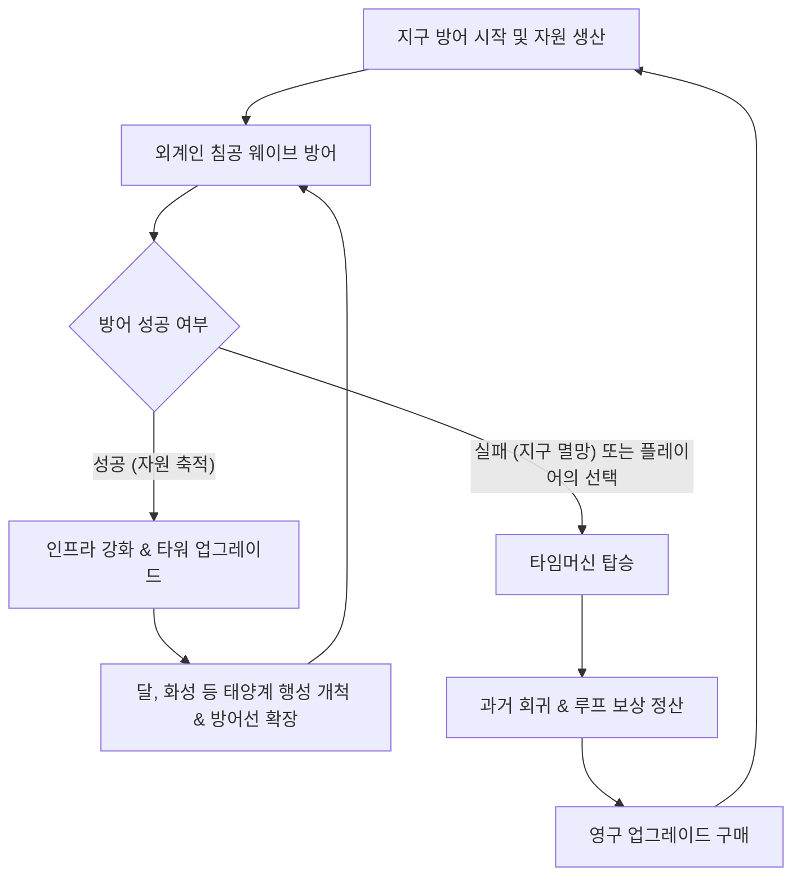
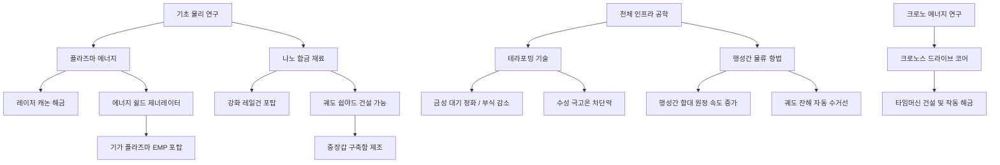
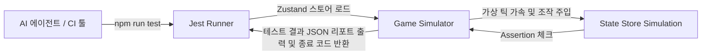

# 게임 기획서: 디펜스 어스 (Defense Earth: Cosmic Loop)

지구와 태양계를 위협하는 외계 침공에 맞서 싸우며, 인프라를 구축하고 타임 루프(환생)를 통해 한계를 극복해 나가는 SF 방어/경영 시뮬레이션 게임입니다.

---

## 1. 게임 개요 (Game Overview)

* **게임 제목:** 디펜스 어스: 코스믹 루프 (Defense Earth: Cosmic Loop)
* **장르:** 방어(디펜스) + 자원 관리(시뮬레이션) + 로그라이트(환생/루프)
* **플랫폼:** 모바일 (iOS & Android) 및 웹 브라우저
* **개발 스택:** React Native (Expo) + JavaScript (ES6+) + React Native Skia (고성능 2D 게임 전투 캔버스) + Zustand (글로벌 게임 상태 관리)
* **핵심 컨셉:** 
  * 외계인의 침공으로부터 지구와 태양계 행성들을 방어.
  * 멸망의 위기에서 타임머신을 가동하여 과거로 회귀.
  * 회귀 시 유지되는 영구적인 기술 및 자원을 활용해 점점 더 강해지는 인프라 구축.
  * 지구에서 시작해 달, 화성, 금성, 수성 등 태양계 전체로 전선을 확장하며 최종 외계 모선을 격퇴.

---

## 2. 핵심 게임 루프 (Core Game Loop)



1. **생산 및 건설 (Build & Produce):** 행성에 자원 생산 시설(발전소, 광산, 연구소)을 건설하여 크레딧과 에너지를 확보하고 방어 무기를 건설합니다.
2. **침공 방어 (Defend):** 실시간으로 침공해 오는 외계 함대의 공격을 타워와 궤도 방어선으로 막아냅니다.
3. **영역 확장 (Expand):** 지구가 안정화되면 위성인 달을 개척하고, 화성, 금성, 수성 등 태양계 행성으로 영토 및 방어선을 넓힙니다.
4. **멸망 및 회귀 (Loop & Reincarnation):** 
   * 방어선이 뚫려 지구(본진)가 파괴되거나, 플레이어가 전술적 필요에 의해 타임머신을 작동시키면 게임이 리셋됩니다.
   * 리셋 시 행성들의 개발 상태와 일반 타워는 사라지지만, **'시공의 입자(Time Particles)'**를 획득하여 영구 업그레이드를 해금할 수 있습니다.

---

## 3. 주요 게임 시스템 (Key Systems)

### 3.1. 자원 및 경제 시스템 (Resources & Economy)
본 게임은 캐주얼한 플레이를 지향하여, 행성별로 자원을 개별 관리하거나 물리적으로 수송해야 하는 복잡성을 배제합니다. **모든 자원은 '태양계 연합 금고(Global Pool)'에 실시간 통합**되어 태양계 어느 행성에서든 즉시 공유하여 건물을 건설하고 타워를 배치하는 데 사용할 수 있습니다.

| 자원명 | 획득 방법 | 주요 용도 |
| :--- | :--- | :--- |
| **크레딧 (Credits)** | 모든 개척 행성의 세금, 외계 함선 처치 | 시설 건설, 타워 구매, 행성 업그레이드 |
| **에너지 (Energy)** | 모든 개척 행성의 발전소(태양광, 핵융합 등) 총합 | 기지 유지보수, 레이저/보호막 타워 상시 충전 |
| **나노코어 (Nanocores)** | 특정 위험 행성 자동 채굴, 보스 처치 | 하이테크 타워 건설 및 우주 전함 생산 |
| **시공의 입자 (Time Particles)** | 지구 멸망(루프) 시 기여도 비례 획득, 타임머신 가동 | **[영구]** 회귀 업그레이드 연구 |

---

### 3.2. 행성 개발 및 테라포밍 시스템 (Solar System Expansion & Terraforming)
플레이어는 지구에서 시작하여 태양계 중심부로 진출하며 방어망을 넓힙니다. 단, **지구를 제외한 모든 행성은 테라포밍(Terraforming)이 필수적**이며, 테라포밍 진행도에 따라 건설 가능한 건물의 등급과 생산 효율이 결정됩니다.

#### 1) 테라포밍 진행 방식 (Terraforming Mechanics)
* **초기 상태 (척박함):** 행성 최초 발견 시 테라포밍 진행율은 `0%`입니다. 이 상태에서는 오직 **'테라포밍 전초기지(Terraforming Outpost)'**와 기초 채굴기만 건설할 수 있으며, 방어 타워 건설 시 비용이 200~300% 폭증하고 생산 건물 효율은 80% 감소합니다.
* **프로세스:** 전초기지에서 막대한 에너지와 자원(크레딧/나노코어)을 공급하면 테라포밍 수치가 점진적으로 상승합니다.
* **개발 한계점 (Milestones):**
  * **0% ~ 29% (개척 단계):** 기초 자원 시설 및 1단계 방어 타워만 건설 가능 (패널티 극심).
  * **30% ~ 79% (안정화 단계):** 2단계 타워 건설 가능, 기지 부식 및 방사능 등 고유 디버프 패널티 50% 감쇄.
  * **80% ~ 100% (완전 정착):** 쉽야드 및 거대 궤도 방어 기지 건설 해금, 행성 생산량 보너스 활성화.

---

#### 2) 행성별 고유 환경 및 테라포밍 과제

1. **지구 (Earth - 인류의 본진):**
   * **특징:** 기본 생산력이 가장 높으며, 파괴 시 강제로 루프가 리셋되는 핵심 행성.
   * **테라포밍 필요 여부:** **없음 (기본 100%)**
   * **환경:** 온화함 (유지 비용 기본값).
2. **달 (Luna - 위성 요충지):**
   * **특징:** 지구의 1차 방패. 희귀 광물(헬륨-3) 채굴이 가능하며, 대기권 밖 궤도 포탑 구축 가능.
   * **테라포밍 과제:** *대기 돔(Biosphere Dome) 압력 유지 및 인공 중력 제어.*
   * **환경 페널티:** 대기 없음 (보호막 복구 시간은 짧으나 포탄 등 물리 방어 기지의 수리비가 늘어남).
3. **화성 (Mars - 군사 제조업 요새):**
   * **특징:** 대규모 쉽야드 건조 및 중장갑 함선 생산의 핵심 기지.
   * **테라포밍 과제:** *이산화탄소 대기 응축 및 행성 온난화 유도.*
   * **환경 페널티:** 척박한 극저온 (온도 조절 인프라에 상시 에너지가 누수됨).
4. **금성 (Venus - 무한한 에너지 광산):**
   * **특징:** 태양광 발전 및 초고온 열에너지 채굴의 최적지. 생산성은 높지만 방어망 유지가 어려움.
   * **테라포밍 과제:** *초고압 대기 배출 및 황산 구름 중화.*
   * **환경 페널티:** 강산성 대기 및 초고압 (테라포밍 60% 이전에는 모든 건물의 내구도가 주기적으로 감소하여 지속적인 유지보수비 발생).
5. **수성 (Mercury - 내행성 최전방 초소):**
   * **특징:** 태양과 가장 가까워 외계인의 내행성계 진입을 감시하고 차단하는 초소.
   * **테라포밍 과제:** *태양 대전입자 방사능 차폐막(Shield) 설치 및 극심한 일교차 열 관리.*
   * **환경 페널티:** 극심한 방사능 (테라포밍 80% 완료 전에는 정밀 전자 기기를 사용하는 최첨단 연구 건물의 건설 비용이 300% 증가).
6. **목성 (Jupiter - 초대형 가스 거인 및 자원 보고):**
   * **특징:** 강력한 중력으로 위성(가니메데, 유로파 등) 개척의 허브이자 액체 수소 에너지 생산의 중심지.
   * **테라포밍 과제:** *대기 극 초고압 중화 및 대적반(Great Red Spot) 폭풍 통제 장치 가동.*
   * **환경 페널티:** 초강력 중력 및 방사능 (가스 거인 행성 특성상 지상 기지는 건설 불가능하며, 오직 궤도 방어 기지 및 위성 기지로만 개발 가능. 궤도 시설의 에너지 쉴드 유지 비용 200% 증가).
7. **토성 (Saturn - 메가 쉽야드 고리 허브):**
   * **특징:** 거대한 궤도 고리(Ring)를 뼈대 삼아 태양계 최대 규모의 함대를 건조하는 초거대 쉽야드를 운영할 수 있는 요충지.
   * **테라포밍 과제:** *고리 파편(얼음/암석) 궤도 안정화 및 먼지 폭풍 중화.*
   * **환경 페널티:** 고리 파편 충돌 위험 (테라포밍 완료 전까지 궤도 방어 위성과 쉽야드가 주기적으로 데미지를 입어 수리 비용 발생).
8. **천왕성 (Uranus - 혹한의 메탄 광산):**
   * **특징:** 옆으로 누운 특이한 자전축을 가진 행성. 핵융합 연료로 쓰이는 헬륨-3 및 특수 메탄 에너지의 대량 채굴 가능.
   * **테라포밍 과제:** *누운 자전축으로 인한 극단적인 계절 기후 극복 및 절대영도 혹한 차단막 가동.*
   * **환경 페널티:** 절대온도 수준의 혹한 (에너지 공급 건물의 발전량이 50% 반토막 나며, 열에너지 공급 시설 배치가 필수).
9. **해왕성 (Neptune - 최외곽 심우주 차단벽):**
   * **특징:** 태양계 외곽의 경계로, 외계인의 웜홀 최초 출현을 가장 먼저 마주하는 최전방 방어 요새 행성.
   * **테라포밍 과제:** *초속 수백 미터의 초강력 메탄 대기 대폭풍 제어.*
   * **환경 페널티:** 극도의 폭풍 (지상 건설 완전 불가, 오직 궤도 방어 기지와 쉽야드를 단단히 닻으로 고정한 요새만 구축 가능).
10. **명왕성 (Pluto - 왜소행성 / 비밀 프로젝트 기지):**
    * **특징:** 태양계 공식 행성은 아니지만, 인류가 외계인의 침공을 사전에 감지하고 최첨단 시간제어 유물(타임머신 프로토타입)을 연구하는 비밀 기지.
    * **테라포밍 과제:** *극저온 얼음 지표면 용해 및 유기물 인프라 기반 조성.*
    * **환경 페널티:** 희박한 자원 및 우주 고립 (생산 속도가 70% 감소하며 지구로부터의 물류 수송 기술이 필요).

---

#### 3) 인구 및 노동력 시스템 (Population & Labor System)
각 행성의 생산성과 방어 한계를 올리기 위해 테라포밍과 연계된 **인구(Population) 관리**를 단순화된 패시브 방식으로 제공합니다.

* **테라포밍 진행도별 인구 수용 한계치 (Max Population Limit):**
  * **0% ~ 29% (개척 초기):** 인구 수용량 최대 **500명** (기초 거주 구역 한정).
  * **30% ~ 79% (환경 안정화):** 인구 수용량 최대 **10,000명** (지표 도시 활성화).
  * **80% ~ 100% (완전 정착):** 최대 **1,000,000명** 수용 가능.
* **인구 유입 메커니즘 (Migration):**
  * **패시브 자동 이주:** 행성의 테라포밍 진행도가 `30%` 이상이 되면, 지구로부터 매 분마다 인구가 패시브로 안전하게 자동 유입됩니다. (물리적인 이주선 수송 및 피습 조작 없음)
  * **자연 증가율:** 테라포밍 진행도가 `80%`를 초과하면 자연적인 인구 증가 가속 버프가 부여됩니다.
* **인구수의 쓰임새 (Population Utility):**
  * **세금 수입 (Credit Generation):** 행성 인구 1,000명당 시간당 100 크레딧의 기본 세금이 글로벌 금고로 자동 합산됩니다.
  * **노동력 요구 (Labor Requirement):** 
    * 고등급 방어 시스템(예: 궤도 쉽야드, 기가 플라즈마포)을 건설 및 유지하기 위해서는 최소 거주 인구수 요건이 필요합니다.
    * *예시:* 궤도 쉽야드 가동(필수 거주 인구 5,000명 이상), 기가 플라즈마포 가동(필수 거주 인구 1,000명 이상). 조건 충족 시 타워와 쉽야드가 100% 가동됩니다.
* **민간인 피해 및 복구 (Casualties & Recovery):**
  * 적의 포격이 행성 보호막(Aegis Shield)을 뚫고 지상 시설을 직접 타격할 경우 인구가 감소합니다.
  * 인구가 감소하면 세금 수입이 일시적으로 줄어들지만, 공격이 멈추고 테라포밍 상태가 유지되면 시간이 흐름에 따라 다시 자동으로 인구가 채워집니다.

* **인구 수송(이주선) 편의성:**
  * 인구 유입이 활성화되면 성계 지도 상에서 지구로부터 해당 행성으로 향하는 **실시간 인구 유입률(Migrants/sec)**이 게이지로 시각화됩니다. 플레이어는 별도 조작 없이 인구가 늘어나는 것을 방치형으로 지켜볼 수 있습니다.

---

#### 4) 행성별 밸런스 데이터 테이블 (Planetary Balance Database)
캐주얼한 성장 곡선을 체계화하기 위해 설계된 태양계 10대 천체의 해금 웨이브, 테라포밍 요구치, 최대 인구수 및 특화 시너지 수치입니다.

| 행성명 | 해금 조건 (웨이브) | 테라포밍 요구 크레딧 | 테라포밍 요구 에너지 | 최대 수용 인구 | 특화 버프 및 시너지 상세 (테라포밍 80% 이상 활성) |
| :--- | :---: | :---: | :---: | :---: | :--- |
| **지구 (Earth)** | 기본 해금 | $0$ (기본 완료) | $0$ (기본 완료) | 2,000,000명 | **[기본]** 크레딧 생산 효율 $+50\%$ ($x1.5$) |
| **달 (Luna)** | 5 돌파 | 15,000 | 8,000 | 50,000명 | 지구 Aegis 보호막 초당 재생률 $+25\%$ 증가 |
| **화성 (Mars)** | 10 돌파 | 60,000 | 30,000 | 250,000명 | 모든 쉽야드의 함대 제조 비용 $-15\%$, 속도 $+20\%$ |
| **금성 (Venus)** | 15 돌파 | 180,000 | 90,000 | 120,000명 | **[에너지 특화]** 발전 인프라 효율 $+150\%$ ($x2.5$), 전체 타워 유지비 $-20\%$ |
| **수성 (Mercury)** | 20 돌파 | 400,000 | 200,000 | 35,000명 | 전방 정찰망 제공, 태양계 모든 포탑/요새 사거리 $+15\%$ |
| **목성 (Jupiter)** | 25 돌파 | 900,000 | 450,000 | 150,000명 | 모든 중력 왜곡기(감속 타워)의 감속 반경 및 범위 $+25\%$ |
| **토성 (Saturn)** | 30 돌파 | 2,000,000 | 1,000,000 | 80,000명 | 고리 도크 결합, 모든 궤도 방어 기지(우주 요새) 무기 슬롯 $+1$개 추가 |
| **천왕성 (Uranus)** | 35 돌파 | 4,500,000 | 2,200,000 | 40,000명 | 초저온 냉각 터빈 가동, 태양계 모든 타워 연사 딜레이 $-10\%$ |
| **해왕성 (Neptune)** | 40 돌파 | 10,000,000 | 5,000,000 | 20,000명 | 외곽 조기 경보, 적 침공 감지 예고시간 $+60$초 연장, 적 이동 속도 $-10\%$ |
| **명왕성 (Pluto)** | 45 돌파 | 25,000,000 | 12,000,000 | 5,000명 | 시간 유물 동조, 타임머신 충전 속도 $+30\%$ 가속 |

---

### 3.3. 다층 방어 체계 및 시스템 (Multi-layered Defense System)
행성 방어망은 지상 기지를 전면 배제하고, 오직 **궤도 방어 위성**, **궤도 방어 기지**, **궤도 쉽야드 및 방어부대**, 그리고 **행성 실드 발생기**의 4중 구조로 궤도 중심의 방어체계를 구축하여 입체감을 높입니다.

#### 1) 지상 방어 기지 (Ground Defense Bases) [폐지]
* **폐지 사유:** 지상에서는 대기와 강력한 중력으로 인해 적의 궤도 함선을 향한 효율적인 방어 및 공격 전술을 수립하기가 매우 어려운 관계로, 지상 방어 기지(Ground Defense Bases) 시스템은 완전히 폐지되었습니다.
* **통합 사항:** 이에 따라 모든 행성 방어 및 공격 체계는 **궤도 방어 위성 (Orbital Defense Satellites)**으로 전면 일원화되며, 기존의 지상 요격 기능(키네틱 격추 등) 또한 궤도 위성 시스템(예: 타겟팅 레이저 위성 등)에 흡수되어 작동하도록 설계가 고도화됩니다.
* **동기화 및 테스트 일관성:** E2E 테스트 및 요격 계산 호환을 위해, 궤도 상에 건설되는 **타겟팅 레이저 위성**이 실질적인 '키네틱 요격 기능'을 겸하도록 통합되어 가동 개수에 따라 지구 보호 요격률이 상승합니다.

#### 2) 궤도 방어 위성 (Orbital Defense Satellites)
* **개요:** 행성 주변 궤도를 끊임없이 공전하는 무인 위성 형태의 소형 방어 장치이며, 레이저 무기로 적을 직접 타격합니다.
* **시각화 및 타격 판정 (공전 렌더링, 공격 발사 및 충돌 판정):** 건설된 궤도 위성은 행성(지구) 주변 궤도 상에 실시간으로 렌더링되며, 게임 시뮬레이션의 일시정지 및 배속에 완벽히 동기화되어 공전(초당 15도 회전)합니다. 위성 본체와 좌우 태양광 패널 구조물 형태를 가집니다. 위성에서 발사되는 모든 공격 투사체(에너지 레이저 등)는 게임 루프의 위성 회전 각도 상태값(`satelliteRotation`)과 동기화되어 공전 궤도 상에 위치하는 개별 위성의 정확한 실시간 X, Y 좌표에서 직접 발원하여 타겟 적 함선의 위치로 발사되도록 설계하여, 어떠한 배속이나 일시정지 상황에서도 발사 지점의 시각적 일관성을 보장합니다.
* **충돌 기반 데미지 지연 처리:** 발사된 투사체(레이저/미사일)가 표적 적 함선에 물리적으로 닿는 순간(충돌 시점)에 비로소 데미지 및 상태 이상(스턴, 감속) 효과가 적용됩니다. 이를 통해 투사체가 날아가는 도중에 적이 미리 폭발해버리는 시각적 불일치 현상을 방지합니다.
* **건설 실패 피드백 세분화:** 지상 기지와 동일하게 건설 실패 시 원인별(최대 위성 한도 도달(5개), 크레딧 부족, 가용 전력 부족)로 구체적인 경고 알림창을 표시합니다.
* **공격 위성:**
  * **타겟팅 레이저 위성:** 120 HP 데미지, 3 초 쿨다운, 단일 함선 직접 사격.
  * **플라즈마 레이저 위성:** 180 HP 데미지, 5 초 쿨다운, 집중 고출력 레이저.
  * **EMP 위성:** 0 HP 데미지, 6 초 쿨다운, 적 전자계 마비·쿨다운 초기화.
  * **클러스터 미사일 위성:** 90 HP x3, 8 초 쿨다운, 3방향 분산 미사일.
  * **중력 포탄 위성:** 160 HP 데미지, 6 초 쿨다운, 적 이동 속도 -40% AoE.
  * **반물질 포 위성:** 400 HP 데미지, 15 초 쿨다운, 초고화력, 실드 무시.
* **지원·방어 위성:**
  * **조기 경보 센서 위성:** 적 함선 탐지 반경 +50%, 공격 미동.
  * **포스 실드 위성:** 궤도 시설 실드 배리어 생성, 쿨다운 30 초.
  * **디코이(미끼) 위성:** 미사일 유도 흡수 후 자폭, 소모품.
  * **수리 드론 위성:** 아군 함선 HP 20/초 회복, 상시.
* **장단점:** 건설 비용이 저렴하고 넓은 범위 커버, 하지만 내구도가 낮아 광역 공격에 쉽게 파괴됩니다.

#### 3) 궤도 방어 기지 (Orbital Defense Stations)
* **개요:** 궤도 상에 고정 설치되는 대형 우주 군사 요새입니다. 행성 방어망의 중추 역할을 담당하며 대형 보스전에 필수적입니다.
* **주요 모듈:**
  * **행성 보호막 발생기 (Aegis Shield):** 행성 전체 또는 주변 궤도 시설물까지 덮는 강력한 플라즈마 보호막을 재생성합니다.
  * **기가 플라즈마포 (EMP):** 충전 시간이 길지만 발사 시 거대한 범위 내의 적 함선들을 마비 상태로 만드는 특수 주포입니다.
  * **중력 왜곡기:** 강력한 중력장을 전개하여 범위 내 적 함대의 전진 속도를 비약적으로 늦춥니다.
* **장단점:** 전술적 가치가 매우 높고 아군 요격기들의 버프 스테이션 역할을 하지만, 막대한 자원(나노코어, 에너지)과 건설 시간이 필요합니다.

#### 4) 궤도 쉽야드 및 방어부대 (Orbital Shipyard & Defense Fleet)
* **개요:** 궤도 상에 우주 조선소(Shipyard)를 건설하고, 적의 침공에 유동적으로 대처할 수 있는 능동 기동 부대를 생산합니다.
* **공격 유닛:**
  * **무인 요격기 드론 (Interceptors):** 60 HP 데미지, 1.5 초 쿨다운, HP 200, 빠른 속도의 소형 전투기.
  * **구축함 (Destroyers):** 350 HP 데미지, 5 초 쿨다운, HP 1,500, 중입자포로 대형함 전면전.
  * **중순양함 (Cruisers):** 600 HP 데미지, 8 초 쿨다운, HP 4,000, 광역 포격·중화력.
  * **스텔스 암살자 (Stealth Assassins):** 800 HP 데미지, 12 초 쿨다운, HP 800, 은폐 접근 후 암살.
  * **이온 전함 (Ion Battleship):** 1,200 HP 데미지, 20 초 쿨다운, HP 8,000, 전략 무기급 주포.
* **방어 유닛:**
  * **방어용 호위함 (Escort Frigates):** 미사일 폭격 차단·아군 보호, HP 2,500, 실드 요격 특화.
  * **실드 탱크 함 (Shield Carriers):** 아군 함대 실드 +30%, HP 3,000, 배리어 발사기 장착.
  * **수리함 (Repair Ships):** 아군 HP 50/초 지속 회복, HP 1,200, 후방 지원.
  * **포스 배리어 함 (Barrier Ships):** 광역 배리어 전개, HP 2,000, 진형 방어막.
* **자동 정비 및 보충 시스템 (Fleet Auto-Replenish):**
  * **함대 슬롯 예약 (Fleet Slots):** 쉽야드는 크기(등급)에 따라 배치할 수 있는 함대 최대 수용량이 정해져 있습니다. 플레이어는 쉽야드 관리창에서 원하는 함대 비율(예: 요격 드론 10기, 호위함 2기 등)을 최초 1회만 설정(슬롯 예약)해 둡니다.
  * **무인 자동 재생산:** 전투 중 소속 함선이 격침당하면, 쉽야드에서 글로벌 금고의 크레딧 및 나노코어를 사용하여 **자동으로 재생산 대기열에 넣어 신규 보충**합니다. 플레이어의 수동 클릭이나 개입은 요구되지 않습니다.
  * **도크 패시브 수리:** 전투 후 대미지를 입은 함선이 쉽야드 주변 정박 구역으로 회항하면, 쉽야드 전원(Energy)을 소모하여 초당 HP의 $5\%$씩 **무료 패시브 수리**를 진행합니다.
* **장단점:** 침공해 오는 적의 방향으로 **실시간 이동 배치**가 가능하며 방치형으로 완벽하게 운용되나, 파괴 시 글로벌 자원이 지속 소모되는 리스크가 있습니다.
* **UI 표시:** 방어 부대(지상 기지, 궤도 위성, 쉽야드 부대)의 현재 수량, 쿨다운 타이머, 남은 HP 및 에너지 소비를 UI에 실시간으로 표시합니다.

#### 5) 행성 실드 발생기 (Planetary Shield Generators)

* **개요:** 행성 지표면 또는 궤도에 설치하여 행성 전체를 감싸는 에너지 실드를 발생·유지시키는 핵심 방어 인프라.
* **실드 모듈:**
  * **기본 포스필드:** 실드 +500, 재생 10/초, 에너지 5/초, 기본 행성 보호막.
  * **강화 플라즈마 실드:** 실드 +1,500, 재생 25/초, 에너지 15/초, 중화력 공격 차단.
  * **이중 레이어 배리어:** 실드 +3,000, 재생 40/초, 에너지 30/초, 보스급 포격도 흡수.
  * **반사 에너지 실드:** 실드 +2,000, 재생 20/초, 에너지 25/초, 레이저 계열 공격 반사.
  * **위상 실드 (Phase Shield):** 실드 +4,000, 재생 50/초, 에너지 50/초, 물리·에너지 피해 모두 차단.
  * **나노 수리 실드:** 실드 +1,000, 재생 15/초, 에너지 10/초, 실드 붕괴 시 HP 자동 보충.
* **반격 모듈 (실드 피격 시 자동 발동):**
  * **실드 반사포:** 수신 데미지의 30% 반사, 실드 피격 시 자동 발동.
  * **과부하 방전:** 200 HP AoE 광역, 실드 붕괴 직전 자동 방전.
  * **전기장 역류:** 80 HP/초·범위, 실드 활성 중 근접 적에 지속 피해.
* **장단점:** 행성 생존력을 결정하는 최후 방어선. 에너지 소모가 크며, 실드가 모두 소진되면 행성 HP가 직접 감소.
* **UI 표시:** 현재 실드량 / 최대 실드량, 실드 재생 속도, 에너지 소비량을 실시간으로 HUD에 표시.

---

### [Antigravity 추천 방어 기믹 및 시너지 시스템]
기획의 재미와 깊이를 더하기 위해 아래의 시스템 설계를 추천합니다.

1. **다층 실드-아머 붕괴 시너지 (Layered Synergy):**
   * *콤보 플레이:* 궤도 위성(쉴드 감소) ➔ 지상 레일건(장갑 관통 및 감속) ➔ 궤도 쉽야드 요격 부대(마무리 타격 및 잔해 회수)로 이어지는 유기적인 방어 콤보를 설계하여, 다양한 포탑을 골고루 지어야 효율이 극대화되도록 유도합니다.
2. **행성간 방어부대 급파 (Interplanetary Dispatch):**
   * 모든 행성에 비싼 쉽야드를 지을 필요 없이, 군사 요새인 **화성(Mars)**에 대규모 쉽야드를 집중 건설해 둔 뒤, 금성이나 수성에 침공이 발생하면 **함대를 기동하여 원정 방어**를 보낼 수 있는 시스템입니다. 행성 간 이동 시간이 존재하여 타이밍을 재는 전략적 재미를 줍니다.
3. **궤도 잔해 수거 및 재활용 (Debris Scrap System):**
   * 궤도에서 파괴된 외계 함선의 잔해(Scrap)를 쉽야드의 수거선이 회수하여 **나노코어**나 **크레딧**으로 환원하거나, 임시 방어벽을 쌓는 재료로 활용하게 함으로써 전투 중 자원 수급의 다변화를 꾀합니다.

#### 5) 이원화된 방어막 시스템 (Dual Shielding System)
전투의 과학적 고증과 입체성을 더하기 위해, 외계 함선의 공격 유형(광학 에너지 vs 실물 키네틱)에 대응하여 완전히 다른 과학적 작동 원리를 갖는 **이원화된 실드 시스템**을 탑재합니다.

* **A. 흡수형 에너지 실드 (Absorptive Energy Shield - 충전율 vs 소모량 메커니즘):**
  * **과학적 고증 및 원리:** 고밀도 전자기 코일을 가동하여 레이저나 플라즈마 등 고주파 에너지 빔의 에너지를 흩트리지 않고 본체 장치로 **'흡수(Absorb)'**하여 감쇄시킵니다.
  * **전술 작동 기믹:** 이 실드는 고유의 **'초당 실드 충전율(Recharge Rate/sec)'**과 **'실드 최대 용량(Shield Capacity)'**을 가집니다. 적의 레이저 공격으로 깎여 나가는 초당 실드 소모량보다 **아군 실드 시설이 제공하는 초당 충전율이 더 높으면 실드는 100% 붕괴하지 않고 무제한 방어**를 유지할 수 있습니다. 적의 화력이 초당 충전율을 초과하는 순간에만 실드 에너지가 천천히 감소하기 시작하며, 에너지가 0이 되는 순간 오프라인 상태가 됩니다.
  * **인게임 연출:** 빔 공격을 피격당하면 보호막 표면에 강한 빛의 응축파가 발생하며 에너지를 흡수하는 전력 흐름 광원 효과가 연출됩니다.
  * **성능 스펙:** 외계인의 에너지 공격을 100% 흡수. 특수 연구 완료 시 피격 에너지의 $10\%$를 글로벌 전력(Energy)으로 실시간 역전환하여 재자원화합니다. (실물 탄환에는 반응하지 않습니다)

* **B. 탄막 요격형 키네틱 실드 (Flak/SAM Kinetic Shield - 격추 확률 메커니즘):**
  * **과학적 고증 및 원리:** 레일건 철갑탄이나 철갑 미사일 등 질량을 가진 물리적 투사체를 궤도 센서로 조기 스캔하고, **요격 미사일(SAM) 및 탄막(Flak Shells)**을 고속 역사격하여 목표물 도달 전에 강제로 충돌 파괴시킵니다.
  * **전술 작동 기믹:** 실드 게이지가 닳는 개념이 아닌, 날아오는 개별 탄환에 대한 **'격추 확률(Intercept Rate %)'** 방식으로 작동합니다.
  * **관통 피해 패널티:** 만약 아군 방어망의 키네틱 격추율이 **`98%`**라면, 100발의 적 미사일이 날아올 때 98발은 요격되나 **격추되지 못한 2% (2발)의 탄탄은 실드를 관통하여 아군 지상/궤도 시설에 직격 피해**를 입히고 인구를 감소시킵니다. 
  * **완벽 방어 조건:** 요격소의 배치 개수를 중첩하여 늘리거나, 업그레이드 레벨을 최대치로 향상시켜 **격추율을 100%로 채워야만** 단 한 발의 누수도 없이 물리 탄환을 완벽하게 차단할 수 있습니다.
  * **인게임 연출:** 미사일이나 탄환이 날아올 때 궤도 요새에서 소형 자탄이 쏟아져 나가며 궤도 상에서 화려한 폭발(Flak Burst)을 일으켜 투사체를 요격하며, 요격 실패 시 탄환이 보호막을 뚫고 지상 건물에서 폭발하는 연출이 시각화됩니다.

* **실드 vs 아머 공격 상성 테이블 (Combat Mechanics):**
  전투 유닛 및 방어 포탑은 공격 방식에 따라 실드와 아머에 가하는 데미 배율이 완전히 달라집니다.

  | 공격 속성 계열 | 흡수형 에너지 실드 피해 | 키네틱 실드 요격 성공률 | 아머/체력(Armor/HP) 피해 | 대표적인 아군 무기 및 유닛 |
  | :--- | :---: | :---: | :---: | :--- |
  | **에너지 계열 (Energy)** | **$150\%$ (에너지 흡수 소모)** | $0\%$ (요격 불가) | $50\%$ (아머에 반감 피해) | 플라즈마 레이저 캐논, 타겟팅 레이저 위성 |
  | **실물/탄환 계열 (Kinetic)** | $0\%$ (전혀 흡수 안됨) | **$60\%\sim100\%$ (대공 역사격 격추)** | **$150\%$ (기갑 관통 파괴)** | 대함 레일건 요새, 개틀링, 쉽야드 구축함 주포 |
  | **EMP/전술 계열 (EMP)** | **즉시 실드 완전 셧다운** | 무력화 (작동 정지 5초) | 피해 없음 (3초 마비) | 기가 플라즈마 요새포 (액티브 스킬 포함) |

* **실드 복구 및 가동 (Shield Management):**
  * 두 종류의 실드(흡수형 에너지 / 탄막 요격형 키네틱)는 건설 완료 시 추가적인 지속 크레딧 소모 없이 **글로벌 에너지(Energy) 풀의 전력을 나누어 소모**하며 상시 가동됩니다.
  * 흡수형 실드는 비전투 상태에서 에너지를 소모해 초당 2%씩 자동으로 최대 용량까지 충전되며, 탄막 요격형 키네틱 실드는 요격 타워의 개수 및 레벨에 따라 상시 격추율 버프가 패시브로 유지됩니다.

---

### 3.4. 과학 연구소 및 연구 트리 (Science Labs & Research Tree)
행성의 인프라를 성장시키고 새로운 방어 무기를 해금하기 위해서는 각 행성에 **과학 연구소**를 건설하고 연구를 수행해야 합니다. 일반 연구 결과는 타임 루프(환생) 시 초기화되지만, 더 높은 단계의 행성 개척과 타임머신 제작을 위해 필수적입니다.

#### 1) 연구소 건설 및 등급 (Research Lab Tiers)
연구소는 건설된 행성의 기술 인프라 수준에 따라 단계를 올릴 수 있으며, 상위 단계 연구소일수록 고급 테크 트리가 해금됩니다.

* **기초 연구소 (Tier 1 Science Lab):** 
  * *건설 조건:* 지구 또는 달에 건설 가능. (기본 자원 및 소량의 크레딧 필요)
  * *기능:* 초반 생산력 증가, 기초적인 무기(개틀링, 1단계 미사일) 성능 향상 연구 수행.
* **연합 과학 단지 (Tier 2 Science Complex):**
  * *건설 조건:* 화성 개척 완료 및 특수 자원 '나노코어' 10개 보유.
  * *기능:* 중형 함선 제조 기술, 에너지 무기(레이저, 실드 발생기), 행성 테라포밍 효율 연구 수행.
* **크로노스 드라이브 연구소 (Tier 3 Chronos Lab):**
  * *건설 조건:* 수성/금성 개척 완료 및 다수의 연구원 수용. 지구에 단 1개만 건설 가능.
  * *기능:* 기가 플라즈마포(EMP), 대형 우주 전함 생산 기술, 그리고 최종 목표인 **'타임머신(Chronos Drive)'** 핵심 부품 연구.

---

#### 2) 일반 연구 트리 (In-Game Research Tree)



* **[병기 연구 부문 - 무기 및 방어군 강화를 주력]**
  * *탄도학 개론:* 레일건 및 개틀링의 사거리 +10%.
  * *고장력 나노 아머:* 지상 방어 기지 및 궤도 기지의 기본 체력 증가.
  * *궤도 도크 설계:* 궤도 쉽야드를 건설하여 요격기 및 호위함을 건조할 수 있게 함.
  * *중장갑 구축함 도면:* 쉽야드에서 강력한 한 방을 쏘는 대형 구축함 생산 가능.
* **[자원 & 환경 제어 부문 - 행성 생산성 및 확장 대비]**
  * *태양광 파동 집속:* 발전소의 에너지 생산량 +15%.
  * *헬륨-3 정제법:* 달 전용 자원 추출 효율 증가.
  * *중력 제어 가스 제어기:* 금성의 강산성 대기로 인한 기지 부식 속도를 30% 늦춤.
  * *방사능 차폐 배리어:* 수성의 방사능 디버프를 무효화하여 건설 비용을 정상화함.
* **[우주 물류 & 기동 부문 - 영역 확장을 위한 가교]**
  * *타키온 엔진:* 행성간 방어부대의 급파 이동 속도 40% 증가.
  * *궤도 스크랩 매그넷:* 적 함선 잔해 수거 효율 증가 및 나노코어 획득 확률 향상.
* **[크로노스 드라이브 연구 - 엔드게임 목표]**
  * *시공간 곡률 역학:* 타임머신 제작 필수 선행 기술.
  * *크로노스 코어 동조:* 타임머신 가동 시 소실되는 데이터 비율을 낮춰, 다음 루프 시 추가 시공의 입자를 10% 더 획득하게 함.

---

#### 3) 외계 아티팩트 역공학 연구 (Reverse Engineering)
거대 보스(아포칼립스 파괴함, 크로노 디바우러 등)를 격퇴하면 폭발 연출과 함께 지표면이나 궤도 공간에 특수 수집품인 **'외계 코어 아티팩트 (Alien Core Artifact)'**가 드롭됩니다. 플레이어가 이를 클릭하여 수집하면, 과학 연구소에서 아래와 같은 강력한 외계 오버테크 연구를 수행할 수 있습니다. (루프 리셋 시에는 소멸하지만, 해당 회차 웨이브 돌파에 절대적인 화력을 제공합니다)

* **외계 역공학 연구 리스트:**
  * **외계 플라즈마 집속 기술 (요구: 아포칼립스 코어 1개):**
    * *효과:* 태양계 내의 모든 에너지 타워(레이저 캐논, EMP 포탑 등)의 사거리 $+20\%$ 및 적의 실드를 100% 관통하는 특성 부여.
  * **나노 재생 입자 모방 (요구: 하이브 코어 1개):**
    * *효과:* **'나노 수리 분사기'** 건물 해금. 건설 시 매초 주변 아군 지상/궤도 타워의 내구도를 최대 체력의 $2.5\%$씩 지속 수리.
  * **시공 안정화 코어 개조 (요구: 디바우러 코어 1개):**
    * *효과:* 태양계 광역 액티브 스킬인 '시간 일시 역행(Nano Rewind)'의 역행 시간을 기존 $5$초에서 $8$초로 확장하고, 스킬 쿨타임을 $30\%$ 영구 감소.
  * **중력 제어 펄스 복제 (요구: 고정함 코어 1개):**
    * *효과:* **'중력 격막 포탑'** 설계도 해금. 포격 적중 시 타겟 주변에 소형 블랙홀을 전개하여 주변 적 함선들을 3초간 한 곳으로 무력화하며 끌어당김.

---

### 3.5. 타임머신 및 회귀 시스템 (Time Machine & Reincarnation)
* **타임머신 개발:** 게임 진행 중 과학 연구소에서 '크로노스 드라이브(Chronos Drive)' 기술을 해금하고 건설해야 작동할 수 있습니다.
* **리셋 트리거:**
  * **강제 리셋:** 외계 군세에 밀려 지구의 체력이 0이 되는 순간 타임머신이 자동으로 발동하며 멸망 시점 직전의 특이점을 지나 과거로 돌아감.
  * **선택적 리셋:** 플레이어가 현재 루프의 성장이 정체되었다고 판단할 때, 자발적으로 타임머신을 가동하여 현재까지 축적된 문명 가치를 '시공의 입자'로 치환하여 환생.
#### 3) 영구 업그레이드 (크로노스 연구소 - Chronos Lab)
환생 시 정산된 **'시공의 입자 (Time Particles - TP)'**를 소모하여 영구적인 특성 업그레이드를 해금합니다. 업그레이드는 크게 **생산/개척**, **전투/무장**, **시공/특수**의 3대 계열로 분류됩니다.

##### A. 생산 및 개척 계열 (Production & Colonization)
| 업그레이드명 | 영구 효과 | 최대 레벨 | 레벨당 비용 (TP) | 레벨당 효과 상세 |
| :--- | :--- | :--- | :--- | :--- |
| **시공의 투자 (Time Investment)** | 루프 시작 시 기본 크레딧 보너스 | 10 | $15 \times L$ | 시작 크레딧 $+2,000$ (최대 $+20,000$) |
| **나노 복제 동조 (Nano Sync)** | 루프 시작 시 기본 나노코어 보너스 | 5 | $50 \times L$ | 시작 나노코어 $+1$ (최대 $+5$) |
| **엔지니어 오버클럭 (Overclock)** | 모든 인프라 및 방어 타워 건설 속도 향상 | 10 | $20 \times L$ | 건설 속도 $+5\%$ 향상 (최대 $+50\%$) |
| **급속 테라포밍 (Terra-Boost)** | 타 행성 테라포밍 전초기지 효율 증가 | 5 | $40 \times L$ | 테라포밍 비용 $-5\%$ 및 속도 $+10\%$ (최대 비용 $-25\%$) |

##### B. 전투 및 무장 계열 (Combat & Weaponry)
| 업그레이드명 | 영구 효과 | 최대 레벨 | 레벨당 비용 (TP) | 레벨당 효과 상세 |
| :--- | :--- | :--- | :--- | :--- |
| **크로노 중첩 탄환 (Chrono Ammo)** | 지상 포탑 및 궤도 기지 무기의 기본 공격력 | 20 | $12 \times L$ | 모든 포탑 데미지 $+3\%$ (최대 $+60\%$) |
| **타키온 조준선 (Tachion Sight)** | 모든 방어 시스템의 사거리 증가 | 10 | $25 \times L$ | 포탑 및 궤도 무기 사거리 $+2\%$ (최대 $+20\%$) |
| **위성 구조 강화 (Sat Structure)** | 궤도 위성 및 방어 기지 최대 체력/쉴드 증가 | 10 | $18 \times L$ | 궤도 방어망 구조물 쉴드량 $+5\%$ (최대 $+50\%$) |
| **함대 전술 고도화 (Fleet Tactics)** | 궤도 쉽야드 생성 기동 부대의 이속/사거리 | 10 | $30 \times L$ | 기동 함대 이동속도 $+4\%$, 사거리 $+2\%$ (최대 $+40\%$/$+20\%$) |

##### C. 시공 및 특수 계열 (Spacetime & Special)
| 업그레이드명 | 영구 효과 및 해금 조건 | 최대 레벨 | 고정 비용 (TP) | 효과 상세 |
| :--- | :--- | :--- | :--- | :--- |
| **시공간 수확기 (TP Harvester)** | 루프 리셋 시 획득하는 TP 효율 증대 | 5 | $100 \times L$ | 최종 획득 시공의 입자(TP) $+15\%$ (최대 $+75\%$) |
| **설계도 시간 보존: 쉽야드** | 루프 시작 시 궤도 쉽야드 기술 자동 해금 | 1 | 150 (고정) | 과학 연구소 등급에 관계없이 궤도 쉽야드 건설 활성화 |
| **설계도 시간 보존: 실드** | 루프 시작 시 에너지 실드 기술 자동 해금 | 1 | 300 (고정) | 과학 연구소 등급에 관계없이 에너지 실드 제너레이터 활성화 |
| **웜홀 예측 프로토콜** | 다음 루프의 외계 침공 정보 사전 해금 | 2 | $100 \times L$ | **1레벨:** 침공 3분 전 안내 / **2레벨:** 적 침공 함선 구성 및 규모 표시 |

---

##### D. 시공의 입자 (TP) 획득 공식
매 루프 종료 시 아래 공식에 의해 시공의 입자가 정산됩니다.
$$\text{획득 TP} = \left( \frac{\text{최종 돌파 웨이브 수} \times 10 + \text{총 소모 크레딧}}{10,000} + \text{테라포밍 완료 행성 수} \times 50 \right) \times (1 + \text{TP Harvester 보너스})$$

---

### 3.6. 태양계 연동 시너지 시스템 (Solar Synergy System)
행성 간의 직접적인 자원 수송선 조작을 제거하는 대신, **특정 행성의 테라포밍이 80% 이상 완료되면 태양계 전체 방어망에 강력한 상시 패시브 효과**를 제공하는 '태양계 연동 시너지'를 적용합니다. 플레이어는 어떤 행성을 우선 개발할지 전략적으로 선택하게 됩니다.

* **행성별 태양계 상시 패시브 버프 (Global Synergy Buffs):**
  * **달 (Luna):** 지구의 기본 보호막(Aegis Shield) 초당 재생 속도 $+25\%$ 증가. (지구 방패 역할 극대화)
  * **금성 (Venus):** 에너지 인프라 효율 대폭 증가. 태양계 모든 행성 방어 타워의 에너지 유지 비용 $-20\%$ 감소.
  * **화성 (Mars):** 군사 제조업 효율 공유. 모든 행성의 궤도 쉽야드 함선 생산 비용 $-15\%$ 감소 및 생산 속도 $+20\%$ 가속.
  * **수성 (Mercury):** 전방 정찰망 확충. 모든 행성 방어 무기의 사거리 $+15\%$ 증가.
  * **목성 (Jupiter):** 중력 연구 완료. 모든 행성 중력 왜곡기(감속 타워)의 감속 범위 $+25\%$ 확대.
  * **토성 (Saturn):** 고리 조선 기술 적용. 모든 궤도 방어 기지(우주 요새)의 무기 모듈 슬롯 $+1$개 추가 해금.
  * **천왕성 (Uranus):** 혹한의 냉각 공학 도입. 모든 포탑의 쿨타임(연사 속도) $-10\%$ 단축.
  * **해왕성 (Neptune):** 최외곽 감시망 구축. 외계 함선의 침공 웨이브 경고 시간이 $1$분 더 연장되고, 적의 비행 속도 상시 $-10\%$ 감속.
  * **명왕성 (Pluto):** 시간 역학 유물 활스팅. 타임머신 충전 속도 $+30\%$ 가속.

---

### 3.7. 캐주얼 편의 기믹 및 자동화 시스템 (Casual Automation & QoL)
플레이어가 불필요한 노가다와 복잡한 인프라 관리로 피로해지지 않도록 직관적인 QoL(Quality of Life) 요소를 제공합니다.

1. **전술 배속 및 웨이브 스킵:**
   * **배속 제어:** 1배속 및 **2배속**을 기본 지원하여 자원 대기 시간의 지루함을 없앱니다.
   * **조기 웨이브 호출 (Early Wave Call):** 외계 침공 카운트다운 중에 즉시 웨이브를 시작할 수 있으며, 단축된 시간만큼 **보너스 크레딧**을 즉시 수령합니다.
2. **자동 재건 (Auto-Rebuild) 및 자동 강화:**
   * **자동 재건:** 지상 포탑이나 궤도 위성이 외계 포격에 의해 파괴되었을 때, 글로벌 크레딧이 충분하면 그 자리에 동일 등급의 타워를 1초 후 자동으로 재건축합니다. (토글 스위치로 온/오프 가능)
   * **자동 강화 예약:** 크레딧이 설정한 특정 수치를 넘으면 지정한 종류(예: 개틀링 포탑 우선)의 타워들을 자동으로 순차 강화합니다.
3. **일체형 자동 테라포밍 (One-Click Terraforming):**
   * 행성 전초기지에 '자동 테라포밍 투자'를 활성화해 두면, 글로벌 크레딧/에너지가 가득 차기 전에 잉여 자원을 테라포밍 수치로 즉시 자동 변환합니다.
4. **태양계 광역 액티브 스킬 (Global Cooldowns):**
   * **태양 폭풍 (Solar Flare):** 태양 코로나를 강제 방출해 특정 행성 궤도의 소형 외계 함선 떼를 일시에 소멸시킵니다. (쿨타임 30초)
   * **시간 일시 역행 (Nano Rewind):** 적 함대 전체의 기동 위치를 5초 전으로 강제 타임 루프시켜 재조준 시간을 확보합니다. (쿨타임 90초)

---

### 3.8. 비즈니스 모델 및 유료화 (Monetization & BM)
플레이어의 성취감을 해치지 않는 편의성과 치장(Cosmetics) 요소를 중심으로 한 합리적이고 거부감 없는 비즈니스 모델을 구축합니다.

1. **광고 제거 프리미엄 패스 (Ad-Free Pass - $4.99):**
   * 인게임 내 보상형 광고(루프 시 TP 정산 보상 2배, 일일 무료 자원 팩 등)를 광고 시청 대기 없이 **즉시 획득**할 수 있게 해줍니다.
   * 패스 소지 시 무제한 **4배속 초고속 모드**가 해금됩니다.
2. **시공의 패스 (Time Pass / Battle Pass - 시즌당 $9.99):**
   * 플레이어가 도달한 최대 웨이브 수, 테라포밍 행성 개수 등 미션을 완수할 때마다 진척도 포인트가 쌓여 보상을 받습니다.
   * 유료 패스 구매 시 특별한 **타워 발사 이펙트 스킨**(예: 네온 핑크 레이저, 은하수 미사일 궤적)과 **행성 테마 꾸미기 스킨**을 획득할 수 있습니다.
3. **영구 편의성 패키지 (Automation Upgrade - $2.99):**
   * **자동 재건 모듈** 및 **자동 강화 예약 슬롯** 기능을 활성화합니다. (무과금 유저의 경우 일일 광고를 1회 시청하면 당일 하루 동안 무료로 활성화됩니다.)
4. **치장 스킨 샵 (Cosmetic Shop):**
   * 플레이어 본진 지구의 외형 스킨 (예: 사이버펑크 지구, 기계도시 지구, 홀로그램 행성).
   * 궤도 쉽야드에서 사출되는 드론/구축함의 모델링 변경 스킨.

---

## 4. 외계 침공 및 보스 시스템 (Alien Invasion & Boss System)

### 4.1. 웜홀 진입 및 침공 경로 (Wormhole & Invasion Route)
* **외곽 진입로:** 외계 함선은 태양계 최외곽의 **해왕성/명왕성 인근 웜홀**을 통해 최초로 시공간을 찢고 침입합니다.
* **진격 단계:** 침공군은 바깥쪽 행성(해왕성 ➔ 천왕성 ➔ 토성 ➔ 목성 ➔ 화성 ➔ 금성/수성 ➔ 달 ➔ 지구)의 방어망을 차례대로 파괴하며 태양계 중심부(본진 지구)를 향해 안쪽으로 조여 들어옵니다.
* **침공 긴장도 (Threat Level):** 외곽 행성에 강력한 방어선을 구축해 침공군을 묶어둘 수 있으나, 외곽 방어선이 무너지면 지구의 긴장도가 상승하여 적의 스폰 주기와 공격 공격력이 최대 2배까지 상승합니다.
* **스폰 거리 및 광역 시야:** 적 함선은 행성 중심부로부터 **반경 750**의 심우주 경계 영역에서 웜홀을 통해 스폰됩니다. 플레이어는 화면을 줌아웃하여 저 먼 외곽에서부터 적들이 지구 궤도를 향해 천천히 다가오는 움직임을 조망하고 전략적인 대응 시간을 가질 수 있습니다.

---

### 4.2. 외계 함선 종류 및 행동 패턴 (Alien Fleet Roster)

외계 침공군은 다양한 체급과 특수 기능을 가진 함선들로 구성되어 있어, 플레이어로 하여금 단일 무기 도배가 아닌 다층적인 방어망 조성을 요구합니다.

#### 1) 소형 함선군 (Light Class - 기동성 및 교란 특화)
* **초기 스카우트 드론 (Scout Drone):**
  * *스펙:* 속도 최상, 체력 최하, 실드 없음.
  * *행동 패턴:* 방어 타워 사각지대를 파고들어 아군 시설 정보를 웜홀로 송신합니다.
  * *대응/공략:* 사거리와 회전 속도가 빠른 지상의 **대공 개틀링**이나 쉽야드의 **무인 요격 드론**으로 스캔이 끝나기 전에 점사 처리해야 합니다.
* **가미카제 밤바 (Kamikaze Bomber):**
  * *스펙:* 속도 상, 체력 하, 물리 장갑 없음.
  * *행동 패턴:* 아군 방어 위성이나 지상 포탑 중 가장 취약한 대상을 타겟팅해 초고속 돌진 자폭 공격을 시도합니다.
  * *대응/공략:* 타격 시 쉴드를 무시하므로, 돌진 경로에 **디코이(미끼) 위성**을 띄워 유도하거나 지대공 광선포로 진입 전 요격해야 합니다.
* **재머 프레깃 (Jammer Frigate):**
  * *스펙:* 속도 중상, 체력 중하, 실드 보유.
  * *행동 패턴:* 강력한 전자기 간섭 파동을 뿜어 주변 반경 내 아군 방어 타워들의 조준 락온 속도를 50% 늦추고 명중률을 30% 저하시킵니다.
  * *대응/공략:* 전자 교란을 무시하는 **물리 실물 레일건**이나 쉽야드의 **방어용 요격 기동대**를 수동 조작해 점사 파괴하는 것이 효과적입니다.

#### 2) 중형 함선군 (Medium Class - 방어막 무력화 및 타겟 약탈)
* **실드 바이패서 (Shield Bypasser):**
  * *스펙:* 속도 중, 체력 중, 특수 위상 쉴드.
  * *행동 패턴:* 궤도 방어 기지가 펼친 대형 아에기스(Aegis) 실드를 통과해 지상 시설에 직접적 데미지를 입히는 위상 전이 어뢰를 발사합니다.
  * *대응/공략:* 실드는 무시하나 아머가 약하므로 **지상의 고화력 대함 레일건** 관통탄으로 껍질을 부수어야 합니다.
* **납치 강습선 (Abductor Corvette):**
  * *스펙:* 속도 상, 체력 중상, 견인 광선 탑재.
  * *행동 패턴:* 행성 궤도에 정박하여 지상의 거주 구역으로 견인 광선을 쏘아 인구를 빨아들여 납치해갑니다. 납치당하는 동안 행성 인구수가 지속 감소하여 세금 및 노동력 손실이 발생합니다.
  * *대응/공략:* 납치 광선을 작동하는 동안 함선이 제자리에 고정되므로, 쉽야드의 **요격기 드론**을 보내거나 **지상 요격 미사일**을 집중 포격하여 신속히 격침해야 합니다.
* **아머 멜터 (Armor Melter):**
  * *스펙:* 속도 중하, 체력 중, 산성 대기 차폐.
  * *행동 패턴:* 지상 기지나 궤도 요새에 특수 황산 이온 포탄을 던집니다. 타격을 받은 아군 구조물은 30초간 모든 받는 대미지가 2배로 증가하는 부식 디버프에 걸립니다.
  * *대응/공략:* 부식이 가속화되기 전에 **플라즈마 레이저 캐논**을 집중 조사해 가열하여 화학 배리어를 폭파해야 합니다.

#### 3) 대형 함선군 (Heavy Class - 화력 공습 및 전장 제어)
* **리버 구축함 (Reaver Destroyer):**
  * *스펙:* 속도 하, 체력 상, 고밀도 복합 아머 장착.
  * *행동 패턴:* 아주 긴 사거리의 대구경 중입자포를 장착하여, 아군 지상 방어 타워의 사거리 바깥 궤도에 고정 정박한 채 포격을 가합니다.
  * *대응/공략:* 사거리가 긴 **궤도 유도 미사일 사일로**를 활용하거나 쉽야드에서 생산한 **중장갑 크루저 함대**를 정박 위치로 직접 출격시켜 공성해야 합니다.
* **하이브 드론 캐리어 (Hive Carrier):**
  * *스펙:* 속도 하, 체력 최상, 자가 수리 나노머신 탑재.
  * *행동 패턴:* 소형 무인 외계 요격 드론을 한 번에 15~20기씩 실시간으로 사출합니다. 아군 방어 타워들의 조준 대상을 교란하고 화력을 낭비시킵니다.
  * *대응/공략:* 개별 드론을 잡는 것보다 **기가 플라즈마포(EMP)**를 쏘아 사출된 드론을 광역 마비시키거나 본체를 일점사해야 합니다.
* **중력 고정함 (Gravity Anchor):**
  * *스펙:* 속도 최하, 체력 상, 강력한 인력 엔진.
  * *행동 패턴:* 행성 궤도에 닻을 내린 후 강력한 중력장을 발생시킵니다. 이 중력장에 걸린 궤도 위성들은 공전 궤도를 이탈하여 서로 부딪히거나 지상으로 추락합니다.
  * *대응/공략:* 아군 궤도망 전체를 붕괴시키는 1순위 타겟이므로, 중력 고정 장치가 활성화되는 즉시 최첨단 **기가 플라즈마포** 및 **레일건 요새**의 사격을 집중해야 합니다.

#### 4) 특수 함선군 (Special Class - 변수 창출)
* **크로노 사이폰 (Chrono Siphon):**
  * *스펙:* 속도 보통, 체력 상, 특수 위상 변이(무적 판정 주기 있음).
  * *행동 패턴:* 플레이어의 **타임머신 충전 에너지**와 **시공간 데이터**를 실시간으로 해킹하고 빨아들여 충전율을 감소시킵니다. 방치할 경우 지구 멸망 시 획득할 수 있는 '시공의 입자(TP)' 수치도 하락합니다.
  * *대응/공략:* 위상 변이를 풀기 위해 **조기 경보 센서 위성**의 감지 빔을 쬐어 실체화시킨 뒤, 기동 함대로 파괴해야 합니다.

---

### 4.3. 거대 보스 디바우러 (Boss Dreadnoughts)
특정 주기(매 10웨이브 마다 또는 최종 외곽 전선 돌파 시)마다 등장하는 거대 보스 함선은 행성 자체를 마비시키는 치명적인 전술 패턴을 구사합니다.

#### 1) 보스 1: 아포칼립스 파괴함 (Apocalypse World-Ender)
* *주기:* 매 10 웨이브마다 개척된 무작위 행성에 돌입.
* *전술 패턴:*
  * **행성 파괴 광선 (Planetary Decimator):** 행성 지표면의 무작위 인프라(발전소, 과학소 등) 한 곳을 붉은색 조준 마크로 락온합니다. 15초의 카운트다운 후 초거대 레이저포를 발사하여 조준 구역을 완전 소멸시킵니다. 궤도 방어 기지의 Aegis 쉴드 에너지를 충전해 막거나, 쉽야드의 돌격 함대가 보스의 주포 엔진 노즐을 파괴해 패턴을 캔슬시켜야 합니다.
  * **나노 전파 방해:** 궤도 위성들의 자세 제어 장치를 해킹하여 20초 동안 모든 방어 위성을 무력화시킵니다.

#### 2) 보스 2: 크로노 디바우러 (Chrono Devourer)
* *주기:* 지구 방어 50웨이브 이상 돌파 시 지구 직접 습격, 또는 명왕성 최외곽 웜홀 공략 시 최종 보스로 출현.
* *전술 패턴:*
  * **시공 정지 막 (Stasis Field):** 넓은 반경의 전자기 역장을 전개하여 범위 내 아군 모든 포탑과 호위함대를 7초간 완전히 정지시킵니다. 이 상태 동안 보스의 호위 부대들이 아군 시설을 일방적으로 타격합니다.
  * **자원 자해 프로토콜:** 플레이어의 태양계 네트워크 망에 바이러스를 심어 보유 중인 크레딧과 에너지를 초당 4%씩 지속 차감시킵니다. 빠르게 보스를 퇴치하지 않으면 방어 시설을 보수할 자금이 바닥나 파멸하게 됩니다.

---

### 4.4. 웨이브 진행 및 스케일링 규칙 (Wave Progression & Difficulty Scaling)

웨이브가 증가함에 따라 외계 군세의 종류, 스폰 속도, 총 침공 수량이 단계적으로 강화됩니다. 난이도의 상승은 개별 스펙의 직접적인 수치 상승보다는 물량의 증가와 고급 함선의 순차적인 등장으로 구현됩니다.

#### 1) 웨이브별 적 출현 해금 규칙 (Enemy Unlock Rules)
- **웨이브 1 ~ 2 (정찰 단계):**
  - 오직 **외계 정찰기 (Scout Drone)**만 출현합니다. (스폰 비율: 100%)
- **웨이브 3 ~ 7 (약탈 단계):**
  - **외계 약탈함 (Raider Frigate)**이 해금되어 함께 출현합니다. (스폰 비율: 정찰기 50% / 약탈함 50%)
- **웨이브 8 이상 (공습 단계):**
  - **외계 아머 멜터 (Destroyer/Armor Melter)**가 해금되어 세 종류의 함선이 조합되어 침공합니다. (스폰 비율: 정찰기 50% / 약탈함 35% / 아머 멜터 15%)
- **매 10 웨이브 (보스 레이드):**
  - 일반 함선들은 스폰되지 않고 오직 단 한 마리의 거대 보스 함선만 웜홀을 통해 단독 진입합니다.
  - **홀수 10단위 (10, 30, 50, 70, 90...):** 보스 `아포칼립스 파괴함 (Apocalypse World-Ender)` 출현.
  - **짝수 10단위 (20, 40, 60, 80, 100...):** 보스 `크로노 디바우러 (Chrono Devourer)` 출현.

#### 2) 침공 물량 및 스폰 주기 스케일링 (Spawn Quantity & Interval Scaling)
- **웨이브당 적선 스폰 총 수량:**
  - 보스 웨이브를 제외한 일반 웨이브의 총 적선 스폰량은 `(3 + 현재 웨이브 번호) * 2` 마리입니다. (예: 1웨이브 = 8마리, 5웨이브 = 16마리, 8웨이브 = 22마리)
  - 보스 웨이브는 항상 `1마리`만 스폰됩니다.
- **적선 스폰 속도 (Spawn Speed):**
  - 일반 웨이브는 적의 스폰 수량이 2배로 늘어남에 따라, 한 웨이브가 완전히 스폰되는 총 소요 시간이 기존과 동일하게 유지되도록 스폰 대기 시간(스폰 주기)이 **절반(1/2)**으로 감축됩니다.
  - **스폰 주기(초) 공식:**
    - **일반 웨이브:** `Math.max(2.0, 5.0 - 현재 웨이브 * 0.1) / 2.0` 초 (예: 1웨이브 기준 **2.45초**)
    - **보스 웨이브:** `Math.max(2.0, 5.0 - 현재 웨이브 * 0.1)` 초 (예: 10웨이브 기준 **4.0초**)
  - 이에 따라 일반 적선은 웨이브가 진행될수록 스폰 간격이 최저 **1.0초**(`2.0초 / 2`)까지 빨라져 더욱 긴박한 전투를 형성합니다.

#### 3) 클리어 및 웨이브 상승 조건 (Wave Completion Trigger)
- 현재 전술 화면 내의 모든 적선이 파괴되고, 이번 웨이브에 예정된 총 스폰량(예: 1웨이브 기준 8마리)이 전부 소진되어 남은 적선 수량(`enemiesRemainingToSpawn`)이 `0`이 되는 순간, 즉시 다음 웨이브로 진행되며 화면 상단의 HUD에 웨이브 완료 및 신규 웨이브 진입 로그가 표시됩니다.

---

## 5. UI 및 화면 구성 기획 (UI & Screens)

### 5.1. 공통 탑/바텀 HUD (Global HUD)
모든 게임 화면의 상단과 하단에 상시 배치되어 플레이어에게 핵심 정보를 제공하는 정보창 인터페이스입니다.

```
[탑 HUD] -----------------------------------------------------------------------------
| (⚙️설정) (⏸️) [1x/2x/4x]  💵Credit: 1,520K  ⚡Energy: 420K/500K  💎Nanocore: 12  ⏳Wave 8 (0:45) |
-------------------------------------------------------------------------------------
[바텀 HUD] --------------------------------------------------------------------------
| 🌀TP: 420 (시공의 입자)       [🕒타임머신 충전율: 42.5%]       [🌌태양계 성계도 / 🔬크로노스 연구소] |
-------------------------------------------------------------------------------------
```
* **탑 HUD 항목:**
  * **일시정지 및 배속 컨트롤:** 캐주얼 플레이 편의성을 위한 게임 속도 일시정지, 1배속, 2배속, 4배속(광고 제거 패키지 전용) 버튼.
  * **글로벌 자원 표시기:** 공유 자원인 크레딧(Credit), 사용 에너지/총 발전 에너지(Energy), 특수 부품(Nanocore).
  * **웨이브 카운트다운:** 현재 진행 중인 웨이브 번호 및 다음 적 함선이 스폰되기까지 남은 타이머. (조기 시작 버튼 포함)
* **바텀 HUD 항목:**
  * **TP 현황:** 현재 영구적으로 보유하고 있는 시공의 입자 개수.
  * **타임머신 충전 게이지:** 100% 충전 시 언제든지 사용자가 자발적으로 루프를 돌아 환생할 수 있는 활성화 게이지.

---

### 5.2. 화면별 텍스트 와이어프레임 및 UI 상세

#### 1) 메인 태양계 성계도 (Solar System Map View)
* **화면 개요:** 태양을 중심으로 수성, 금성, 지구, 달, 화성, 목성, 토성, 천왕성, 해왕성, 명왕성이 공전 궤도선 위에 표시되는 거시적 관리 화면입니다.

```
-----------------------------------------------------------------------------------------
|                                  [태양계 성계도]                                       |
|                                                                                       |
|   (명왕성) - - (해왕성) - - (토성) - - (목성) - - (지구/달) - - (수성) - - [☀️태양]      |
|    0% (🔒)      10% (⚠️)     80% (🛡️)     90%       100% (🏠)     80%                     |
|                   🔴 적 진입 중                                                       |
|                                                                                       |
|  -----------------------------------------------------------------------------------  |
|  | [선택 행성 요약: 화성]                                                           |  |
|  | 테라포밍: 80% (안정) | 인구: 120,400명 (세금 +1,200/h)                           |  |
|  | 버프: 쉽야드 제조비 -15% 적용 중                                                  |  |
|  | [ 🔍 행성 진입 (전투/건설) ]    [ 🚀 이주 지원 예약 (패시브) ]                       |  |
|  -----------------------------------------------------------------------------------  |
-----------------------------------------------------------------------------------------
```
* **인터랙션 및 연출:**
  * **행성 선택:** 공전 중인 행성을 터치/클릭하면 화면 하단에 해당 행성의 요약 카드가 노출됩니다.
  * **침공 경보:** 외계선이 진입 중인 궤도에 붉은색 섬광과 함께 적 함선 아이콘 및 돌입 예측 라인이 그려져 캐주얼하고 직관적인 전황 모니터링을 지원합니다.
  * **행성 진입:** 요약 카드의 '행성 진입' 버튼을 누르면 5.2.2의 상세 기지 건설/전투 화면으로 카메라가 줌인되며 전환됩니다.

#### 2) 행성 상세 및 전투 뷰 (Planet Tactical View)
* **화면 개요:** 각 행성의 표면(지상 타일)과 궤도(위성 타일) 그리드가 보이는 종진 격전지 화면입니다.

```
-----------------------------------------------------------------------------------------
|   [행성명: 금성 (Venus)]                             [🔥태양 폭풍]  [⏳시간 역행]      |
|                                                                                       |
|   [ 🪐 궤도 그리드 영역 ] (공전 궤도선을 따라 위성 배치)                              |
|     [🛰️위성]                  [🚢적 리버 크루저]                                        |
|   - - - - - - - - - - - - - - - - - - - - - - - - - - - - - - - - - - - - - - - - -   |
|   [ ⛰️ 지표면 그리드 영역 ] (지상 건물 및 포탑 배치)                                  |
|      [🏠주거 돔]      [⚙️발전소]      [🗼대포탑]                                       |
|                                                                                       |
|  -----------------------------------------------------------------------------------  |
|  | [건설 메뉴]                                                                       |  |
|  | 지상: [🗼레일건포: $100] [⚡실드: $150] [⚙️발전소: $80] [🏠거주구역: $50]          |  |
|  | 궤도: [🛰️레이저위성: $200] [🛸쉽야드: $400]           (⚙️자동 재건 토글: [ON])     |  |
|  -----------------------------------------------------------------------------------  |
-----------------------------------------------------------------------------------------
```
* **인터랙션 및 연출:**
  * **그리드 터치 건설:** 비어 있는 타일을 클릭하면 링 모양의 퀵 건설 UI가 발생하여 자원을 소모해 즉시 타워나 유틸리티 건물을 건설합니다.
  * **QoL 스크립트:** 하단 우측의 `자동 재건 토글` 버튼을 활성화하면 적에 의해 타워가 부서져도 글로벌 자원이 있을 때 자동으로 재배치 연출이 일어납니다.
  * **광역 액티브 스킬:** 화면 상단 우측에 있는 [태양 폭풍]과 [시간 역행] 쿨타임 버튼을 터치하여 실시간 전투 보조 스킬을 쏩니다.
  * **카메라 조작 및 줌 배율:**
    * **조작:** 드래그 제스처로 카메라 시점을 자유롭게 이동(Pan)할 수 있으며, 마우스 휠이나 핀치 줌 및 화면 우측 하단의 HUD 버튼을 통해 카메라 줌 배율을 조절할 수 있습니다.
    * **줌 범위:** 최소 `0.15` (15% 시야)부터 최대 `3.0` (300% 시야)까지의 줌 배율을 지원하여, 최대 줌아웃 시 침공로 멀리서부터 접근하는 외계 적 함선들을 더 일찍 감시하고 대응 전술을 구상할 수 있게 지원합니다.
    * **무한 우주 격자 격사 배경:** 줌아웃을 극대화했을 때 시각적 경계가 끊기지 않도록, 우주 배경의 격자선(Grid)과 골든 스타 트랙은 `-990`부터 `1530` 크기 영역까지 확장 렌더링되어 광활하고 이음새 없는 심연의 우주 공간을 시각화합니다.

#### 3) 크로노스 연구소 (Chronos Rebirth Lab)
* **화면 개요:** 타임머신을 가동해 환생하거나, 시공의 입자(TP)를 소모해 영구 특성 업그레이드를 찍는 몽환적인 성운 아키텍처 화면입니다.

```
-----------------------------------------------------------------------------------------
|                                  [🔬크로노스 연구소]                                  |
|   보유 시공의 입자(Time Particles): 🌀 420 TP                                         |
|                                                                                       |
|               [생산/개척 계열]           [전투/무장 계열]           [시공/특수 계열]      |
|                                                                                       |
|     Lv.3       [시공의 투자]              [크로노 탄환]             [TP 수확기]          |
|                  (10/10) Max                (5/20)                    (1/5)           |
|                       |                         |                       |             |
|     Lv.4       [급속 테라포밍]            [타키온 조준선]           [설계도: 쉽야드]      |
|                  (2/5)                      (1/10)                    (0/1)           |
|                                                                                       |
|  -----------------------------------------------------------------------------------  |
|  | [ 🚀 타임머신 가동 및 루프 실행 ] (현재 가동 시 정산 예정 TP: 🌀 +180 TP)           |  |
|  -----------------------------------------------------------------------------------  |
-----------------------------------------------------------------------------------------
```
* **인터랙션 및 연출:**
  * **스킬 노드 활성화:** 특성 노드를 터치하면 필요한 TP가 소모되며 레벨이 상승하고 버프 수치가 실시간 갱신됩니다.
  * **시간 회귀 가동:** 하단의 '타임머신 가동' 버튼을 누르면 화면 중앙으로 시공간이 접혀 들어가는 강렬한 연출과 함께 정산 요약 팝업이 노출되며 `1웨이브의 지구`로 루프 리셋됩니다.

---

## 6. 개발 로드맵 (Development Roadmap)

* **Phase 1: 프로토타입 개발 (지구 방어 & 루프)**
  * 지구 1개 행성에서의 방어 시스템 구현.
  * 기본 타워 2종, 외계선 2종 구현.
  * 지구 파괴 시 타임머신 연출 및 영구 업그레이드 1단계 테스트.
* **Phase 2: 행성 확장 및 자원 최적화**
  * 달, 화성 개척 시스템 추가.
  * 자원 연동 및 다중 행성 모니터링 시스템 구축.
  * 특수 무기(궤도 미사일 등) 및 거대 보스전 구현.
* **Phase 3: 태양계 전체 완성 및 밸런싱**
  * 금성, 수성 고유 환경 디버프 및 전용 콘텐츠 추가.
  * 환생 업그레이드 밸런스 튜닝 및 엔드게임 콘텐츠(외계 모선 본거지 역침공) 구현.

---

## 7. 에이전트 기반 자동 검증 및 구현 하네스 (Automated Verification Harness)

개발 과정에서 AI 에이전트가 작성한 코드의 정상 작동 여부를 스스로 테스트하고 품질을 관리하기 위해, Jest 테스트 환경과 Zustand 상태 시뮬레이션을 활용한 **자동 플레이테스트 및 기능 검증 하네스**를 구축합니다.

### 7.1. 시스템 아키텍처



### 7.2. 주요 검증 시나리오 및 에이전트 행동 (Playtest Scenarios)

검증 테스트 스크립트(`__tests__/game_simulation.test.js`)가 Zustand 스토어를 로드하고, 게임 루프를 초고속(Virtual Time Ticks)으로 가동하며 시스템 무결성을 테스트합니다.

1. **경제 & 인프라 빌드 시나리오 (Economy Test):**
   * 시뮬레이터가 자원 건물(발전소, 광산)의 가상 건설 액션을 트리거하여 그리드에 추가합니다.
   * 시간 경과 틱을 주입한 뒤, 글로벌 크레딧과 에너지 값이 기획서 상의 수식 및 밸런스 테이블 계수대로 정확히 상승하는지 확인합니다.
   * 자원이 부족한 상태에서 건설 액션을 호출했을 때 예외 에러가 정상적으로 스로우되는지 검증합니다.
2. **다층 방어 및 요격 시나리오 (Defense & Combat Test):**
   * 특정 행성의 궤도 상태에 적 정찰 함선 10대를 강제로 주입(Mock Spawning)합니다.
   * 요격 위성과 지상 레일건이 타겟 감지 틱을 통해 적의 쉴드/체력을 올바르게 갉아먹는지 계산식을 검증합니다.
   * 쉽야드를 건설하고 요격기 드론을 생산 상태로 두었을 때, 드론이 파괴된 함대 슬롯을 인지하고 글로벌 자원을 인출해 자동 재생산 주기가 동작하는지 테스트합니다.
3. **타임 루프 정산 시나리오 (Time Loop & Reincarnation Test):**
   * 지구의 체력(HP) 상태를 가상으로 0으로 변경합니다.
   * 즉시 타임 루프 리셋 프로토콜이 발동하며, '시공의 입자(TP) 정산 공식'에 의거해 정확한 포인트가 계산되어 누적 스토어에 보존되는지 확인합니다.
   * 루프 후 일반 자원은 초기값으로 리셋되지만, 보존된 TP로 크로노스 연구소를 업그레이드하고 영구 버프가 다음 루프 시작 상태에 정상 주입되는지 최종 확인합니다.

### 7.3. 검증 실행 방법 (Command Line Harness)

검증 테스트를 헤드리스 환경에서 실행하고 정합성 결과를 판단하기 위해 아래 명령어를 사용합니다.

```bash
# Jest를 이용해 무인으로 게임 시뮬레이션 및 스토어 정합성 테스트 수행
npm install && npm run test
```

* **테스트 구동기 역할:**
  1. Zustand 게임 상태 스토어 및 모의 전투 시뮬레이션 로직 로드.
  2. 준비된 시나리오(인프라, 전투, 루프)를 가상 시간 틱 상에서 순차 가동.
  3. 모든 시나리오 검증 성공 시 `Exit Code: 0` 반환.
  4. 도중 Assert 실패 시 에러 스택 트레이스 출력 및 `Exit Code: 1` 반환하여 CI 빌드를 중단시킵니다.

